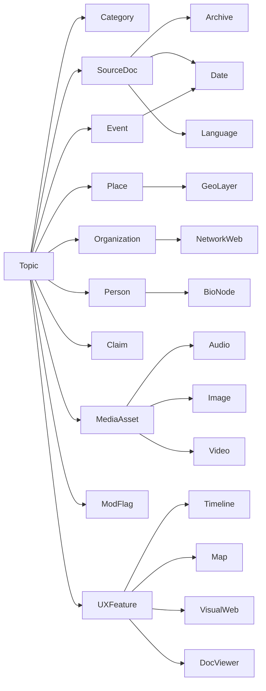
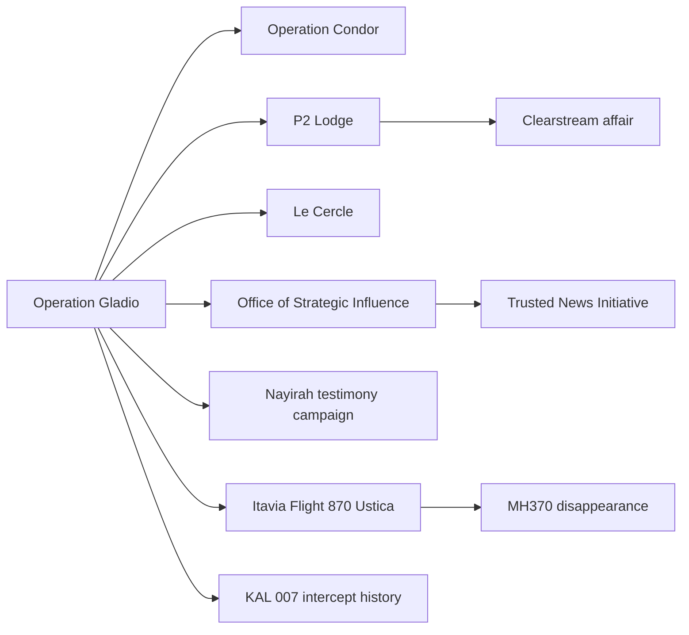

# Expanded Conspiracy Knowledge Graph Buildout

## Executive Summary

I treated your uploaded public topic index and master build plan as the exclusion set, then filled adjacent gaps that are source-rich but not already obvious in the live catalog. Your index already lists 435 topics across the current public site, and the build plan shows additional mapped/planned nodes, so the list below is aimed at depth, not duplication. fileciteturn0file0 fileciteturn0file1

The strongest first-wave additions are the topics that already have public documentary trails in declassification systems, court dockets, company filings, patent databases, accident archives, and remote-sensing tools. That is why the table below leans hard into government/black-ops history, UFO/UAP cases with official files, corporate-financial structures, media/psyops, maritime and aviation incidents, and cult/legal records. The public systems that make this scalable include the entity["organization","Central Intelligence Agency","us intelligence agency"] Electronic Reading Room, the entity["organization","Federal Bureau of Investigation","us law enforcement agency"] Vault, the entity["organization","National Archives and Records Administration","us federal archives"] declassification and UAP collections, FOIA.gov, CourtListener/RECAP, the entity["organization","Securities and Exchange Commission","us market regulator"] EDGAR search tools, the entity["organization","World Intellectual Property Organization","un intellectual property agency"] PATENTSCOPE platform, the entity["organization","U.S. Geological Survey","us science agency"] EarthExplorer tool, entity["organization","NASA","us space agency"] Earthdata Search, NOAA chart archives, GEBCO bathymetry, the entity["organization","National Transportation Safety Board","us accident investigator"] report archive, and the Defense Technical Information Center. citeturn12search0turn2search2turn9search6turn0search6turn1search1turn16search2turn4search1turn5search0turn5search3turn11search1turn11search5turn10search8turn15view0

The lead column below is written as a verification entry point, not a truth claim. For weakly documented or folklore-heavy topics, the goal should be rumor genealogy, primary-source discovery, and document comparison, not “proof” writing. Moderation matters most where health claims, living-person accusations, doxxing, swatting, unsolved crimes, casualty events, or extremist material appear. The entity["organization","Federal Trade Commission","us consumer regulator"] requires competent and reliable scientific evidence for health-related claims, and federal law-enforcement guidance makes clear that doxxing and swatting can create real legal and safety exposure. citeturn6search3turn7search4turn7search5turn7search12

Repository shorthand used below: **CIA ER** = CIA Electronic Reading Room / CREST, **NARA** = National Archives, **FBI Vault** = FBI FOIA library, **FOIA/MDR** = Freedom of Information Act / Mandatory Declassification Review, **CL** = CourtListener / RECAP, **SEC** = EDGAR filings, **PPS** = USPTO Patent Public Search, **WIPO** = PATENTSCOPE, **Earthdata** = NASA Earthdata Search, **EE** = EarthExplorer, **CA** = Chronicling America, **NTSB** = accident database/report archive, **OSTI** = DOE Office of Scientific and Technical Information, **DTIC** = Defense Technical Information Center. Priority codes: **T** timeline, **M** map, **W** visual web, **A** audio archive, **D** document viewer. Flag codes: **Liv** living-person/defamation exposure, **Priv** privacy/doxxing, **Cas** casualty or survivor sensitivity, **Health** medical/product-efficacy exposure, **Safety** unsafe-device or hazardous-experiment framing, **Violence** mass-harm/covert-action history, **Harassment** religion/minority targeting risk, **Looting** artifact or heritage-site exploitation, **Extremism** extremist-content handling, **Ongoing** unresolved geopolitical or criminal dispute. citeturn12search0turn2search2turn0search1turn0search6turn1search1turn16search2turn3search3turn4search1turn5search0turn5search3turn4search3turn10search8turn3search7turn15view0

## Knowledge Graph Design

The site should treat each topic as a node that connects outward to source documents, events, places, organizations, people, media artifacts, moderation flags, and suggested interactive treatments. That structure mirrors how the underlying repositories actually expose evidence: document-first archives, public dockets, patent families, company filings, and geospatial layers. citeturn12search0turn0search1turn1search1turn3search3turn4search1turn16search2turn5search0turn5search3turn10search8

A useful sample cluster is one black-ops node that branches into covert operations, allied networks, propaganda frameworks, and downstream aviation/legal mysteries. That creates density fast and makes cross-category surfacing feel intentional rather than random.

## Power, finance, and information operations

| Topic | Category | Rare leads / primary sources | Tags / keywords | Interconnections | Priority | Flags |
|---|---|---|---|---|---|---|
| Operation Gladio | Gov/BlackOps | CIA ER/NARA; MDR/FOIA + Senate/Church. | operation, gladio, gov | Operation CHAOS; COINTELPRO | T+W | Violence |
| Operation CHAOS | Gov/BlackOps | CIA ER/NARA; MDR/FOIA + Senate/Church. | operation, chaos, gov | Project SHAMROCK; Operation Northwoods | T+W | Violence |
| Project SHAMROCK | Gov/BlackOps | CIA ER/NARA; MDR/FOIA + Senate/Church. | project, shamrock, gov | Project MINARET; Global Surveillance Grid | T+W | Violence |
| Project MINARET | Gov/BlackOps | CIA ER/NARA; MDR/FOIA + Senate/Church. | project, minaret, gov | Project BLUEBIRD; COINTELPRO | T+W | Violence |
| Project BLUEBIRD | Gov/BlackOps | CIA ER/NARA; MDR/FOIA + Senate/Church. | project, bluebird, gov | Project ARTICHOKE; Operation Northwoods | T+W | Violence |
| Project ARTICHOKE | Gov/BlackOps | CIA ER/NARA; MDR/FOIA + Senate/Church. | project, artichoke, gov | PROMIS software affair; Global Surveillance Grid | T+W | Violence |
| PROMIS software affair | Gov/BlackOps | CIA ER/NARA/FOIA; CL + IG/hearings. | promis, software, gov | Operation Condor; COINTELPRO | T+W | Violence |
| Operation Condor | Gov/BlackOps | CIA ER/NARA; MDR/FOIA + Senate/Church. | operation, condor, gov | Operation MONGOOSE; Operation Northwoods | T+W | Violence |
| Operation MONGOOSE | Gov/BlackOps | CIA ER/NARA; MDR/FOIA + Senate/Church. | operation, mongoose, gov | Operation Menu; Global Surveillance Grid | T+W | Violence |
| Operation Menu | Gov/BlackOps | CIA ER/NARA; MDR/FOIA + Senate/Church. | operation, menu, gov | Operation Cyclone; COINTELPRO | T+W | Violence |
| Operation Cyclone | Gov/BlackOps | CIA ER/NARA; MDR/FOIA + Senate/Church. | operation, cyclone, gov | Continuity of Government; Operation Northwoods | T+W | Violence |
| Continuity of Government | Gov/BlackOps | NARA continuity/civil-defense; sat/procurement. | continuity, government, gov | Raven Rock Mountain Complex; Global Surveillance Grid | T+W | Violence |
| Raven Rock Mountain Complex | Gov/BlackOps | NARA continuity/civil-defense; sat/procurement. | raven, rock, gov | Mount Weather emergency center; COINTELPRO | T+W | Violence |
| Mount Weather emergency center | Gov/BlackOps | NARA continuity/civil-defense; sat/procurement. | mount, weather, gov | Main Core watchlist; Operation Northwoods | T+W | Violence |
| Main Core watchlist | Gov/BlackOps | CIA ER/NARA/FOIA; CL + IG/hearings. | main, core, gov | Stellar Wind; Global Surveillance Grid | T+W | Violence |
| Stellar Wind | Gov/BlackOps | CIA ER/NARA/FOIA; CL + IG/hearings. | stellar, wind, gov | Room 641A; COINTELPRO | T+W | Violence |
| Room 641A | Gov/BlackOps | CIA ER/NARA/FOIA; CL + IG/hearings. | room, 641a, gov | ECHELON intercept system; Operation Northwoods | T+W | Violence |
| ECHELON intercept system | Gov/BlackOps | CIA ER/NARA/FOIA; CL + IG/hearings. | echelon, intercept, gov | Total Information Awareness; Global Surveillance Grid | T+W | Violence |
| Total Information Awareness | Gov/BlackOps | CIA ER/NARA/FOIA; CL + IG/hearings. | total, information, gov | Operation Garden Plot; COINTELPRO | T+W | Violence |
| Operation Garden Plot | Gov/BlackOps | NARA continuity/civil-defense; sat/procurement. | operation, garden, gov | Operation LAC; Operation Northwoods | T+W | Violence |
| Operation LAC | Gov/BlackOps | CIA ER/NARA; MDR/FOIA + Senate/Church. | operation, lac, gov | MKNAOMI; Global Surveillance Grid | T+W | Violence |
| MKNAOMI | Gov/BlackOps | CIA ER/NARA; MDR/FOIA + Senate/Church. | mknaomi, gov | Midnight Climax; COINTELPRO | T+W | Violence |
| Midnight Climax | Gov/BlackOps | CIA ER/NARA; MDR/FOIA + Senate/Church. | midnight, climax, gov | Operation Bloodstone; Operation Northwoods | T+W | Violence |
| Operation Bloodstone | Gov/BlackOps | CIA ER/NARA; MDR/FOIA + Senate/Church. | operation, bloodstone, gov | Midnight Climax; Global Surveillance Grid | T+W | Violence |
| Le Cercle | Elites | Company/charity filings; minutes, tax docs, or inquiries. | le, cercle, elites | Pilgrims Society; Bilderberg Group | W | Liv |
| Pilgrims Society | Elites | Company/charity filings; minutes, tax docs, or inquiries. | pilgrims, society, elites | Milner Group and Round Table; Council on Foreign Relations | W | Liv |
| Milner Group and Round Table | Elites | Company/charity filings; minutes, tax docs, or inquiries. | milner, group, elites | 1001 Club; Corporate-State Capture | W | Liv |
| 1001 Club | Elites | Company/charity filings; minutes, tax docs, or inquiries. | 1001, club, elites | Safari Club; Bilderberg Group | W | Liv |
| Safari Club | Elites | Company/charity filings; minutes, tax docs, or inquiries. | safari, club, elites | P2 Lodge; Council on Foreign Relations | W | Liv |
| P2 Lodge | Elites | Company/charity filings; minutes, tax docs, or inquiries. | p2, lodge, elites | Group of Thirty; Corporate-State Capture | W | Liv |
| Group of Thirty | Elites | Company/charity filings; minutes, tax docs, or inquiries. | group, thirty, elites | Club de Berne; Bilderberg Group | W | Liv |
| Club de Berne | Elites | Company/charity filings; minutes, tax docs, or inquiries. | club, berne, elites | European Round Table for Industry; Council on Foreign Relations | W | Liv |
| European Round Table for Industry | Elites | Company/charity filings; minutes, tax docs, or inquiries. | european, round, elites | Mont Pelerin Society; Corporate-State Capture | W | Liv |
| Mont Pelerin Society | Elites | Company/charity filings; minutes, tax docs, or inquiries. | mont, pelerin, elites | Council for National Policy; Bilderberg Group | W | Liv |
| Council for National Policy | Elites | Company/charity filings; minutes, tax docs, or inquiries. | council, national, elites | Chatham House networks; Council on Foreign Relations | W | Liv |
| Chatham House networks | Elites | Company/charity filings; minutes, tax docs, or inquiries. | chatham, house, elites | Sovereign Military Order of Malta; Corporate-State Capture | W | Liv |
| Sovereign Military Order of Malta | Elites | Company/charity filings; minutes, tax docs, or inquiries. | sovereign, military, elites | Opus Dei elite networks; Bilderberg Group | W | Liv |
| Opus Dei elite networks | Elites | Company/charity filings; minutes, tax docs, or inquiries. | opus, dei, elites | Bormann capital network; Council on Foreign Relations | W | Liv |
| Bormann capital network | Elites | Company/charity filings; minutes, tax docs, or inquiries. | bormann, capital, elites | Banque Worms nexus; Corporate-State Capture | W | Liv |
| Banque Worms nexus | Elites | Company/charity filings; minutes, tax docs, or inquiries. | banque, worms, elites | Ditchley Foundation networks; Bilderberg Group | W | Liv |
| Ditchley Foundation networks | Elites | Company/charity filings; minutes, tax docs, or inquiries. | ditchley, foundation, elites | Pinay Circle; Council on Foreign Relations | W | Liv |
| Pinay Circle | Elites | Company/charity filings; minutes, tax docs, or inquiries. | pinay, circle, elites | Rhodes scholar patronage web; Corporate-State Capture | W | Liv |
| Rhodes scholar patronage web | Elites | Company/charity filings; minutes, tax docs, or inquiries. | rhodes, scholar, elites | Young Global Leaders program; Bilderberg Group | W | Liv |
| Young Global Leaders program | Elites | Company/charity filings; minutes, tax docs, or inquiries. | young, global, elites | Order of St Hubertus; Council on Foreign Relations | W | Liv |
| Order of St Hubertus | Elites | Company/charity filings; minutes, tax docs, or inquiries. | order, st, elites | Alfalfa Club; Corporate-State Capture | W | Liv |
| Alfalfa Club | Elites | Company/charity filings; minutes, tax docs, or inquiries. | alfalfa, club, elites | Club of the Isles; Bilderberg Group | W | Liv |
| Club of the Isles | Elites | Company/charity filings; minutes, tax docs, or inquiries. | club, isles, elites | Synarchist International; Council on Foreign Relations | W | Liv |
| Synarchist International | Elites | Company/charity filings; minutes, tax docs, or inquiries. | synarchist, international, elites | Club of the Isles; Corporate-State Capture | W | Liv |
| LIBOR manipulation | Corp/Fin | SEC/regulator filings; CL + insolvency/tax papers. | libor, manipulation, corp | London Gold Pool; Federal Reserve | W+T | Liv/fin |
| London Gold Pool | Corp/Fin | SEC/regulator filings; CL + insolvency/tax papers. | london, gold, corp | Eurodollar shadow banking; BlackRock, Vanguard & State Street | W+T | Liv/fin |
| Eurodollar shadow banking | Corp/Fin | SEC/regulator filings; CL + insolvency/tax papers. | eurodollar, shadow, corp | Dark pools and off-exchange trading; Corporate-State Capture | W+T | Liv/fin |
| Dark pools and off-exchange trading | Corp/Fin | SEC/regulator filings; CL + insolvency/tax papers. | dark, pools, corp | Payment for order flow; Federal Reserve | W+T | Liv/fin |
| Payment for order flow | Corp/Fin | SEC/regulator filings; CL + insolvency/tax papers. | payment, order, corp | SWIFT chokepoints; BlackRock, Vanguard & State Street | W+T | Liv/fin |
| SWIFT chokepoints | Corp/Fin | SEC/regulator filings; CL + insolvency/tax papers. | swift, chokepoints, corp | CLS Bank concentration; Corporate-State Capture | W+T | Liv/fin |
| CLS Bank concentration | Corp/Fin | SEC/regulator filings; CL + insolvency/tax papers. | cls, bank, corp | Delaware secrecy industry; Federal Reserve | W+T | Liv/fin |
| Delaware secrecy industry | Corp/Fin | SEC/regulator filings; CL + insolvency/tax papers. | delaware, secrecy, corp | LuxLeaks tax rulings; BlackRock, Vanguard & State Street | W+T | Liv/fin |
| LuxLeaks tax rulings | Corp/Fin | SEC/regulator filings; CL + insolvency/tax papers. | luxleaks, tax, corp | Cum-Ex dividend stripping; Corporate-State Capture | W+T | Liv/fin |
| Cum-Ex dividend stripping | Corp/Fin | SEC/regulator filings; CL + insolvency/tax papers. | cum, ex, corp | Repo market plumbing crises; Federal Reserve | W+T | Liv/fin |
| Repo market plumbing crises | Corp/Fin | SEC/regulator filings; CL + insolvency/tax papers. | repo, market, corp | Commodity warehouse financing games; BlackRock, Vanguard & State Street | W+T | Liv/fin |
| Commodity warehouse financing games | Corp/Fin | SEC/regulator filings; CL + insolvency/tax papers. | commodity, warehouse, corp | Insurance-linked catastrophe bets; Corporate-State Capture | W+T | Liv/fin |
| Insurance-linked catastrophe bets | Corp/Fin | SEC/regulator filings; CL + insolvency/tax papers. | insurance, linked, corp | Basel accords and bank concentration; Federal Reserve | W+T | Liv/fin |
| Basel accords and bank concentration | Corp/Fin | SEC/regulator filings; CL + insolvency/tax papers. | basel, accords, corp | Big Four audit oligopoly; BlackRock, Vanguard & State Street | W+T | Liv/fin |
| Big Four audit oligopoly | Corp/Fin | SEC/regulator filings; CL + insolvency/tax papers. | big, four, corp | Reinsurance cartel history; Corporate-State Capture | W+T | Liv/fin |
| Reinsurance cartel history | Corp/Fin | SEC/regulator filings; CL + insolvency/tax papers. | reinsurance, cartel, corp | ISDA and derivatives netting; Federal Reserve | W+T | Liv/fin |
| ISDA and derivatives netting | Corp/Fin | SEC/regulator filings; CL + insolvency/tax papers. | isda, derivatives, corp | Captive insurance networks; BlackRock, Vanguard & State Street | W+T | Liv/fin |
| Captive insurance networks | Corp/Fin | SEC/regulator filings; CL + insolvency/tax papers. | captive, insurance, corp | Sovereign wealth fund opacity; Corporate-State Capture | W+T | Liv/fin |
| Sovereign wealth fund opacity | Corp/Fin | SEC/regulator filings; CL + insolvency/tax papers. | sovereign, wealth, corp | Clearinghouse risk concentration; Federal Reserve | W+T | Liv/fin |
| Clearinghouse risk concentration | Corp/Fin | SEC/regulator filings; CL + insolvency/tax papers. | clearinghouse, risk, corp | Clearstream affair; BlackRock, Vanguard & State Street | W+T | Liv/fin |
| Clearstream affair | Corp/Fin | SEC/regulator filings; CL + insolvency/tax papers. | clearstream, affair, corp | Bearer shares and anonymous companies; Corporate-State Capture | W+T | Liv/fin |
| Bearer shares and anonymous companies | Corp/Fin | SEC/regulator filings; CL + insolvency/tax papers. | bearer, shares, corp | Offshore law-firm leak trails; Federal Reserve | W+T | Liv/fin |
| Offshore law-firm leak trails | Corp/Fin | SEC/regulator filings; CL + insolvency/tax papers. | offshore, law, corp | SPAC sponsor incentives; BlackRock, Vanguard & State Street | W+T | Liv/fin |
| SPAC sponsor incentives | Corp/Fin | SEC/regulator filings; CL + insolvency/tax papers. | spac, sponsor, corp | Offshore law-firm leak trails; Corporate-State Capture | W+T | Liv/fin |
| Smith-Mundt modernization debate | Psyops | NARA/CIA ER + hearings; PR/grant or contract records. | smith, mundt, psyops | Office of Strategic Influence; Operation Mockingbird | T+W | Liv/politics |
| Office of Strategic Influence | Psyops | NARA/CIA ER + hearings; PR/grant or contract records. | office, strategic, psyops | Office of Public Diplomacy; Hegelian Dialectic & Psyops | T+W | Liv/politics |
| Office of Public Diplomacy | Psyops | NARA/CIA ER + hearings; PR/grant or contract records. | office, public, psyops | Rendon Group campaigns; Predictive Programming | T+W | Liv/politics |
| Rendon Group campaigns | Psyops | NARA/CIA ER + hearings; PR/grant or contract records. | rendon, group, psyops | Lincoln Group military placements; Operation Mockingbird | T+W | Liv/politics |
| Lincoln Group military placements | Psyops | NARA/CIA ER + hearings; PR/grant or contract records. | lincoln, group, psyops | Pentagon military analyst program; Hegelian Dialectic & Psyops | T+W | Liv/politics |
| Pentagon military analyst program | Psyops | NARA/CIA ER + hearings; PR/grant or contract records. | pentagon, military, psyops | Nayirah testimony campaign; Predictive Programming | T+W | Liv/politics |
| Nayirah testimony campaign | Psyops | NARA/CIA ER + hearings; PR/grant or contract records. | nayirah, testimony, psyops | Hill and Knowlton incubator story; Operation Mockingbird | T+W | Liv/politics |
| Hill and Knowlton incubator story | Psyops | NARA/CIA ER + hearings; PR/grant or contract records. | hill, knowlton, psyops | Radio Free Europe covert funding; Hegelian Dialectic & Psyops | T+W | Liv/politics |
| Radio Free Europe covert funding | Psyops | NARA/CIA ER + hearings; PR/grant or contract records. | radio, free, psyops | Congress for Cultural Freedom; Predictive Programming | T+W | Liv/politics |
| Congress for Cultural Freedom | Psyops | NARA/CIA ER + hearings; PR/grant or contract records. | congress, cultural, psyops | Operation Earnest Voice; Operation Mockingbird | T+W | Liv/politics |
| Operation Earnest Voice | Psyops | NARA/CIA ER + hearings; PR/grant or contract records. | operation, earnest, psyops | Astroturf front groups; Hegelian Dialectic & Psyops | T+W | Liv/politics |
| Astroturf front groups | Psyops | NARA/CIA ER + hearings; PR/grant or contract records. | astroturf, front, psyops | Trusted News Initiative; Predictive Programming | T+W | Liv/politics |
| Trusted News Initiative | Psyops | NARA/CIA ER + hearings; PR/grant or contract records. | trusted, news, psyops | Narrative laundering through think tanks; Operation Mockingbird | T+W | Liv/politics |
| Narrative laundering through think tanks | Psyops | NARA/CIA ER + hearings; PR/grant or contract records. | narrative, laundering, psyops | Cambridge Analytica psychographics; Hegelian Dialectic & Psyops | T+W | Liv/politics |
| Cambridge Analytica psychographics | Psyops | NARA/CIA ER + hearings; PR/grant or contract records. | cambridge, analytica, psyops | Twitter Files curation debate; Predictive Programming | T+W | Liv/politics |
| Twitter Files curation debate | Psyops | NARA/CIA ER + hearings; PR/grant or contract records. | twitter, files, psyops | Sockpuppet research programs; Operation Mockingbird | T+W | Liv/politics |
| Sockpuppet research programs | Psyops | NARA/CIA ER + hearings; PR/grant or contract records. | sockpuppet, research, psyops | Deepfake persuasion ops; Hegelian Dialectic & Psyops | T+W | Liv/politics |
| Deepfake persuasion ops | Psyops | NARA/CIA ER + hearings; PR/grant or contract records. | deepfake, persuasion, psyops | Ghost-managed medical journals; Predictive Programming | T+W | Liv/politics |
| Ghost-managed medical journals | Psyops | NARA/CIA ER + hearings; PR/grant or contract records. | ghost, managed, psyops | Behavioral insights units as soft propaganda; Operation Mockingbird | T+W | Liv/politics |
| Behavioral insights units as soft propaganda | Psyops | NARA/CIA ER + hearings; PR/grant or contract records. | behavioral, insights, psyops | NGO media training pipelines; Hegelian Dialectic & Psyops | T+W | Liv/politics |
| NGO media training pipelines | Psyops | NARA/CIA ER + hearings; PR/grant or contract records. | ngo, media, psyops | Counter-messaging grants ecosystem; Predictive Programming | T+W | Liv/politics |
| Counter-messaging grants ecosystem | Psyops | NARA/CIA ER + hearings; PR/grant or contract records. | counter, messaging, psyops | Synthetic grassroots comment floods; Operation Mockingbird | T+W | Liv/politics |
| Synthetic grassroots comment floods | Psyops | NARA/CIA ER + hearings; PR/grant or contract records. | synthetic, grassroots, psyops | Perception-management doctrine; Hegelian Dialectic & Psyops | T+W | Liv/politics |
| Perception-management doctrine | Psyops | NARA/CIA ER + hearings; PR/grant or contract records. | perception, management, psyops | Synthetic grassroots comment floods; Predictive Programming | T+W | Liv/politics |

## Deep past, sacred orders, and anomalous ruins

| Topic | Category | Rare leads / primary sources | Tags / keywords | Interconnections | Priority | Flags |
|---|---|---|---|---|---|---|
| Sea Peoples origins | Ancient | Orig.-lang excavation/philology; museum cats. + old maps. | sea, peoples, ancient | Bronze Age collapse enigma; Göbekli Tepe | T+M | None |
| Bronze Age collapse enigma | Ancient | Orig.-lang excavation/philology; museum cats. + old maps. | bronze, age, ancient | Tartessos disappearance; Suppressed History | T+M | None |
| Tartessos disappearance | Ancient | Orig.-lang excavation/philology; museum cats. + old maps. | tartessos, disappearance, ancient | Doggerland inundation; Ancient cataclysm | T+M | None |
| Doggerland inundation | Ancient | Orig.-lang excavation/philology; museum cats. + old maps. | doggerland, inundation, ancient | Sundaland civilization hypothesis; Göbekli Tepe | T+M | None |
| Sundaland civilization hypothesis | Ancient | Orig.-lang excavation/philology; museum cats. + old maps. | sundaland, civilization, ancient | Green Sahara civilizations; Suppressed History | T+M | None |
| Green Sahara civilizations | Ancient | Orig.-lang excavation/philology; museum cats. + old maps. | green, sahara, ancient | Hyksos expulsion puzzle; Ancient cataclysm | T+M | None |
| Hyksos expulsion puzzle | Ancient | Orig.-lang excavation/philology; museum cats. + old maps. | hyksos, expulsion, ancient | Thera eruption chronology; Göbekli Tepe | T+M | None |
| Thera eruption chronology | Ancient | Orig.-lang excavation/philology; museum cats. + old maps. | thera, eruption, ancient | Vinland Map controversy; Suppressed History | T+M | None |
| Vinland Map controversy | Ancient | Orig.-lang excavation/philology; museum cats. + old maps. | vinland, map, ancient | Aksum stela engineering; Ancient cataclysm | T+M | None |
| Aksum stela engineering | Ancient | Orig.-lang excavation/philology; museum cats. + old maps. | aksum, stela, ancient | Phaistos Disc; Göbekli Tepe | T+M | None |
| Phaistos Disc | Ancient | Orig.-lang excavation/philology; museum cats. + old maps. | phaistos, disc, ancient | Rongorongo script; Suppressed History | T+M | None |
| Rongorongo script | Ancient | Orig.-lang excavation/philology; museum cats. + old maps. | rongorongo, script, ancient | Tartary on early modern maps; Ancient cataclysm | T+M | None |
| Tartary on early modern maps | Ancient | Orig.-lang excavation/philology; museum cats. + old maps. | tartary, early, ancient | Sumerian King List chronology; Göbekli Tepe | T+M | None |
| Sumerian King List chronology | Ancient | Orig.-lang excavation/philology; museum cats. + old maps. | sumerian, king, ancient | Olmec transoceanic contact claims; Suppressed History | T+M | None |
| Olmec transoceanic contact claims | Ancient | Orig.-lang excavation/philology; museum cats. + old maps. | olmec, transoceanic, ancient | Phoenician circumnavigation of Africa; Ancient cataclysm | T+M | None |
| Phoenician circumnavigation of Africa | Ancient | Orig.-lang excavation/philology; museum cats. + old maps. | phoenician, circumnavigation, ancient | Qin tomb mercury rivers; Göbekli Tepe | T+M | None |
| Qin tomb mercury rivers | Ancient | Orig.-lang excavation/philology; museum cats. + old maps. | qin, tomb, ancient | Indus script corpus; Suppressed History | T+M | None |
| Indus script corpus | Ancient | Orig.-lang excavation/philology; museum cats. + old maps. | indus, script, ancient | Hittite collapse mystery; Ancient cataclysm | T+M | None |
| Hittite collapse mystery | Ancient | Orig.-lang excavation/philology; museum cats. + old maps. | hittite, collapse, ancient | Pre-Columbian coca and nicotine mummy debate; Göbekli Tepe | T+M | None |
| Pre-Columbian coca and nicotine mummy debate | Ancient | Orig.-lang excavation/philology; museum cats. + old maps. | pre, columbian, ancient | Vinca symbols; Suppressed History | T+M | None |
| Vinca symbols | Ancient | Orig.-lang excavation/philology; museum cats. + old maps. | vinca, symbols, ancient | Ubar Atlantis of the Sands; Ancient cataclysm | T+M | None |
| Ubar Atlantis of the Sands | Ancient | Orig.-lang excavation/philology; museum cats. + old maps. | ubar, atlantis, ancient | Etruscan language problem; Göbekli Tepe | T+M | None |
| Etruscan language problem | Ancient | Orig.-lang excavation/philology; museum cats. + old maps. | etruscan, language, ancient | Stone Age seafaring to Crete; Suppressed History | T+M | None |
| Stone Age seafaring to Crete | Ancient | Orig.-lang excavation/philology; museum cats. + old maps. | stone, age, ancient | Etruscan language problem; Ancient cataclysm | T+M | None |
| Paris Axe Historique | Symbolism | Dedication records/plans; photo archives + GIS overlays. | paris, axe, symbolism | Brasilia occult urbanism; Freemasonry | M+W | None |
| Brasilia occult urbanism | Symbolism | Dedication records/plans; photo archives + GIS overlays. | brasilia, occult, symbolism | US Capitol cornerstone rites; Obelisks & Pine Cones | M+W | None |
| US Capitol cornerstone rites | Symbolism | Dedication records/plans; photo archives + GIS overlays. | us, capitol, symbolism | Detroit Masonic street-grid claims; CERN & Occult Ritual | M+W | None |
| Detroit Masonic street-grid claims | Symbolism | Dedication records/plans; photo archives + GIS overlays. | detroit, masonic, symbolism | Luxor Las Vegas symbolism; Freemasonry | M+W | None |
| Luxor Las Vegas symbolism | Symbolism | Dedication records/plans; photo archives + GIS overlays. | luxor, las, symbolism | Palace of Peace and Reconciliation; Obelisks & Pine Cones | M+W | None |
| Palace of Peace and Reconciliation | Symbolism | Dedication records/plans; photo archives + GIS overlays. | palace, peace, symbolism | House of the Temple in Washington; CERN & Occult Ritual | M+W | None |
| House of the Temple in Washington | Symbolism | Dedication records/plans; photo archives + GIS overlays. | house, temple, symbolism | St Peter's Square solar geometry; Freemasonry | M+W | None |
| St Peter's Square solar geometry | Symbolism | Dedication records/plans; photo archives + GIS overlays. | st, peters, symbolism | Denver Airport dedication capstone; Obelisks & Pine Cones | M+W | None |
| Denver Airport dedication capstone | Symbolism | Dedication records/plans; photo archives + GIS overlays. | denver, airport, symbolism | Rockefeller Center atlas iconography; CERN & Occult Ritual | M+W | None |
| Rockefeller Center atlas iconography | Symbolism | Dedication records/plans; photo archives + GIS overlays. | rockefeller, center, symbolism | City of London obelisk cluster; Freemasonry | M+W | None |
| City of London obelisk cluster | Symbolism | Dedication records/plans; photo archives + GIS overlays. | city, london, symbolism | Capitoline Hill owl plan; Obelisks & Pine Cones | M+W | None |
| Capitoline Hill owl plan | Symbolism | Dedication records/plans; photo archives + GIS overlays. | capitoline, hill, symbolism | L'Enfant pentagram overlays; CERN & Occult Ritual | M+W | None |
| L'Enfant pentagram overlays | Symbolism | Dedication records/plans; photo archives + GIS overlays. | lenfant, pentagram, symbolism | Arc de Triomphe axis symbolism; Freemasonry | M+W | None |
| Arc de Triomphe axis symbolism | Symbolism | Dedication records/plans; photo archives + GIS overlays. | arc, de, symbolism | Place de la Concorde obelisk; Obelisks & Pine Cones | M+W | None |
| Place de la Concorde obelisk | Symbolism | Dedication records/plans; photo archives + GIS overlays. | place, de, symbolism | National Mall solar alignments; CERN & Occult Ritual | M+W | None |
| National Mall solar alignments | Symbolism | Dedication records/plans; photo archives + GIS overlays. | national, mall, symbolism | Masonic Temple of Philadelphia symbolism; Freemasonry | M+W | None |
| Masonic Temple of Philadelphia symbolism | Symbolism | Dedication records/plans; photo archives + GIS overlays. | masonic, temple, symbolism | Freemasons Hall London icon program; Obelisks & Pine Cones | M+W | None |
| Freemasons Hall London icon program | Symbolism | Dedication records/plans; photo archives + GIS overlays. | freemasons, hall, symbolism | Egyptian revival cemetery symbolism; CERN & Occult Ritual | M+W | None |
| Egyptian revival cemetery symbolism | Symbolism | Dedication records/plans; photo archives + GIS overlays. | egyptian, revival, symbolism | Federal Reserve building iconography; Freemasonry | M+W | None |
| Federal Reserve building iconography | Symbolism | Dedication records/plans; photo archives + GIS overlays. | federal, reserve, symbolism | West Potomac park owl map claims; Obelisks & Pine Cones | M+W | None |
| West Potomac park owl map claims | Symbolism | Dedication records/plans; photo archives + GIS overlays. | west, potomac, symbolism | Canberra geomantic plan; CERN & Occult Ritual | M+W | None |
| Canberra geomantic plan | Symbolism | Dedication records/plans; photo archives + GIS overlays. | canberra, geomantic, symbolism | Avenue of the Dead alignments; Freemasonry | M+W | None |
| Avenue of the Dead alignments | Symbolism | Dedication records/plans; photo archives + GIS overlays. | avenue, dead, symbolism | Astana world religions congress hall; Obelisks & Pine Cones | M+W | None |
| Astana world religions congress hall | Symbolism | Dedication records/plans; photo archives + GIS overlays. | astana, world, symbolism | Avenue of the Dead alignments; CERN & Occult Ritual | M+W | None |
| Process Church of the Final Judgment | Secret Soc | Orig. texts/newsletters; court, tax, or schism records. | process, church, secret soc | Fraternitas Saturni; Freemasonry | W+T | Harassment |
| Fraternitas Saturni | Secret Soc | Orig. texts/newsletters; court, tax, or schism records. | fraternitas, saturni, secret soc | Ordo Templi Orientis; Vatican & Jesuits | W+T | Harassment |
| Ordo Templi Orientis | Secret Soc | Orig. texts/newsletters; court, tax, or schism records. | ordo, templi, secret soc | A∴A∴ occult lineage; Rosicrucians | W+T | Harassment |
| A∴A∴ occult lineage | Secret Soc | Orig. texts/newsletters; court, tax, or schism records. | occult, lineage, secret soc | Palmarian Church; Freemasonry | W+T | Harassment |
| Palmarian Church | Secret Soc | Orig. texts/newsletters; court, tax, or schism records. | palmarian, church, secret soc | Anthroposophy networks; Vatican & Jesuits | W+T | Harassment |
| Anthroposophy networks | Secret Soc | Orig. texts/newsletters; court, tax, or schism records. | anthroposophy, networks, secret soc | Druze initiatory secrecy; Rosicrucians | W+T | Harassment |
| Druze initiatory secrecy | Secret Soc | Orig. texts/newsletters; court, tax, or schism records. | druze, initiatory, secret soc | Mandaean star lore; Freemasonry | W+T | Harassment |
| Mandaean star lore | Secret Soc | Orig. texts/newsletters; court, tax, or schism records. | mandaean, star, secret soc | Nuwaubian movement; Vatican & Jesuits | W+T | Harassment |
| Nuwaubian movement | Secret Soc | Orig. texts/newsletters; court, tax, or schism records. | nuwaubian, movement, secret soc | Temple of Set; Rosicrucians | W+T | Harassment |
| Temple of Set | Secret Soc | Orig. texts/newsletters; court, tax, or schism records. | temple, set, secret soc | Traditionalist School networks; Freemasonry | W+T | Harassment |
| Traditionalist School networks | Secret Soc | Orig. texts/newsletters; court, tax, or schism records. | traditionalist, school, secret soc | Moorish Science offshoots; Vatican & Jesuits | W+T | Harassment |
| Moorish Science offshoots | Secret Soc | Orig. texts/newsletters; court, tax, or schism records. | moorish, science, secret soc | Yezidi Peacock Angel misreadings; Rosicrucians | W+T | Harassment |
| Yezidi Peacock Angel misreadings | Secret Soc | Orig. texts/newsletters; court, tax, or schism records. | yezidi, peacock, secret soc | Church Universal and Triumphant; Freemasonry | W+T | Harassment |
| Church Universal and Triumphant | Secret Soc | Orig. texts/newsletters; court, tax, or schism records. | church, universal, secret soc | Bektashi order secrecy; Vatican & Jesuits | W+T | Harassment |
| Bektashi order secrecy | Secret Soc | Orig. texts/newsletters; court, tax, or schism records. | bektashi, order, secret soc | Subud movement esotericism; Rosicrucians | W+T | Harassment |
| Subud movement esotericism | Secret Soc | Orig. texts/newsletters; court, tax, or schism records. | subud, movement, secret soc | Martinism; Freemasonry | W+T | Harassment |
| Martinism | Secret Soc | Orig. texts/newsletters; court, tax, or schism records. | martinism, secret soc | Builders of the Adytum; Vatican & Jesuits | W+T | Harassment |
| Builders of the Adytum | Secret Soc | Orig. texts/newsletters; court, tax, or schism records. | builders, adytum, secret soc | Order of Nine Angles; Rosicrucians | W+T | Harassment |
| Order of Nine Angles | Secret Soc | Orig. texts/newsletters; court, tax, or schism records. | order, nine, secret soc | Hermetic Brotherhood of Luxor; Freemasonry | W+T | Extremism |
| Hermetic Brotherhood of Luxor | Secret Soc | Orig. texts/newsletters; court, tax, or schism records. | hermetic, brotherhood, secret soc | Theosophical Society secret section; Vatican & Jesuits | W+T | Harassment |
| Theosophical Society secret section | Secret Soc | Orig. texts/newsletters; court, tax, or schism records. | theosophical, society, secret soc | Order of the Golden Dawn splinters; Rosicrucians | W+T | Harassment |
| Order of the Golden Dawn splinters | Secret Soc | Orig. texts/newsletters; court, tax, or schism records. | order, golden, secret soc | Rosae Crucis AMORC archives; Freemasonry | W+T | Harassment |
| Rosae Crucis AMORC archives | Secret Soc | Orig. texts/newsletters; court, tax, or schism records. | rosae, crucis, secret soc | The Family secretive prayer cells; Vatican & Jesuits | W+T | Harassment |
| The Family secretive prayer cells | Secret Soc | Orig. texts/newsletters; court, tax, or schism records. | family, secretive, secret soc | Rosae Crucis AMORC archives; Rosicrucians | W+T | Harassment |
| Yonaguni Monument | Arch Anom | Excavation reports; museum cats. + EE/Earthdata imagery. | yonaguni, monument, arch anom | Bimini Road; Suppressed History | M+D | Looting |
| Bimini Road | Arch Anom | Excavation reports; museum cats. + EE/Earthdata imagery. | bimini, road, arch anom | Longyou Caves; Russian Pyramid Science | M+D | Looting |
| Longyou Caves | Arch Anom | Excavation reports; museum cats. + EE/Earthdata imagery. | longyou, caves, arch anom | Malta cart ruts; Ancient megaliths | M+D | Looting |
| Malta cart ruts | Arch Anom | Excavation reports; museum cats. + EE/Earthdata imagery. | malta, cart, arch anom | Baalbek trilithon quarry stones; Suppressed History | M+D | Looting |
| Baalbek trilithon quarry stones | Arch Anom | Excavation reports; museum cats. + EE/Earthdata imagery. | baalbek, trilithon, arch anom | Nan Madol engineering; Russian Pyramid Science | M+D | Looting |
| Nan Madol engineering | Arch Anom | Excavation reports; museum cats. + EE/Earthdata imagery. | nan, madol, arch anom | Puma Punku precision cuts; Ancient megaliths | M+D | Looting |
| Puma Punku precision cuts | Arch Anom | Excavation reports; museum cats. + EE/Earthdata imagery. | puma, punku, arch anom | Sacsayhuaman masonry; Suppressed History | M+D | Looting |
| Sacsayhuaman masonry | Arch Anom | Excavation reports; museum cats. + EE/Earthdata imagery. | sacsayhuaman, masonry, arch anom | Osireion at Abydos; Russian Pyramid Science | M+D | Looting |
| Osireion at Abydos | Arch Anom | Excavation reports; museum cats. + EE/Earthdata imagery. | osireion, at, arch anom | Gunung Padang dating dispute; Ancient megaliths | M+D | Looting |
| Gunung Padang dating dispute | Arch Anom | Excavation reports; museum cats. + EE/Earthdata imagery. | gunung, padang, arch anom | Vitrified forts; Suppressed History | M+D | Looting |
| Vitrified forts | Arch Anom | Excavation reports; museum cats. + EE/Earthdata imagery. | vitrified, forts, arch anom | Klerksdorp spheres; Russian Pyramid Science | M+D | Looting |
| Klerksdorp spheres | Arch Anom | Excavation reports; museum cats. + EE/Earthdata imagery. | klerksdorp, spheres, arch anom | Antikythera mechanism; Ancient megaliths | M+D | Looting |
| Antikythera mechanism | Arch Anom | Excavation reports; museum cats. + EE/Earthdata imagery. | antikythera, mechanism, arch anom | Dendera light reliefs; Suppressed History | M+D | Looting |
| Dendera light reliefs | Arch Anom | Excavation reports; museum cats. + EE/Earthdata imagery. | dendera, light, arch anom | Baghdad battery; Russian Pyramid Science | M+D | Looting |
| Baghdad battery | Arch Anom | Excavation reports; museum cats. + EE/Earthdata imagery. | baghdad, battery, arch anom | Roman dodecahedra; Ancient megaliths | M+D | Looting |
| Roman dodecahedra | Arch Anom | Excavation reports; museum cats. + EE/Earthdata imagery. | roman, dodecahedra, arch anom | Cochno Stone; Suppressed History | M+D | Looting |
| Cochno Stone | Arch Anom | Excavation reports; museum cats. + EE/Earthdata imagery. | cochno, stone, arch anom | Eltanin antenna object; Russian Pyramid Science | M+D | Looting |
| Eltanin antenna object | Arch Anom | Excavation reports; museum cats. + EE/Earthdata imagery. | eltanin, antenna, arch anom | Ancient geopolymer pyramid claims; Ancient megaliths | M+D | Looting |
| Ancient geopolymer pyramid claims | Arch Anom | Excavation reports; museum cats. + EE/Earthdata imagery. | ancient, geopolymer, arch anom | Paracas skull DNA debates; Suppressed History | M+D | Looting |
| Paracas skull DNA debates | Arch Anom | Excavation reports; museum cats. + EE/Earthdata imagery. | paracas, skull, arch anom | Saqqara bird glider theory; Russian Pyramid Science | M+D | Looting |
| Saqqara bird glider theory | Arch Anom | Excavation reports; museum cats. + EE/Earthdata imagery. | saqqara, bird, arch anom | Bosnian pyramid controversy; Ancient megaliths | M+D | Looting |
| Bosnian pyramid controversy | Arch Anom | Excavation reports; museum cats. + EE/Earthdata imagery. | bosnian, pyramid, arch anom | Sanxingdui bronzes anomaly; Suppressed History | M+D | Looting |
| Sanxingdui bronzes anomaly | Arch Anom | Excavation reports; museum cats. + EE/Earthdata imagery. | sanxingdui, bronzes, arch anom | Roman concrete lost recipe lore; Russian Pyramid Science | M+D | Looting |
| Roman concrete lost recipe lore | Arch Anom | Excavation reports; museum cats. + EE/Earthdata imagery. | roman, concrete, arch anom | Sanxingdui bronzes anomaly; Ancient megaliths | M+D | Looting |

## Space, frontier science, and reality glitches

| Topic | Category | Rare leads / primary sources | Tags / keywords | Interconnections | Priority | Flags |
|---|---|---|---|---|---|---|
| Foo fighters of World War II | UFO/Space | FBI Vault/NARA UAP; local air-force, police, or press. | foo, fighters, ufo | Kecksburg incident; UAP / UFO Disclosure | T+M+W | None |
| Kecksburg incident | UFO/Space | FBI Vault/NARA UAP; local air-force, police, or press. | kecksburg, incident, ufo | Varginha case; Secret Space Programme | T+M+W | None |
| Varginha case | UFO/Space | FBI Vault/NARA UAP; local air-force, police, or press. | varginha, case, ufo | Ariel School encounter; Project BLUE BOOK | T+M+W | None |
| Ariel School encounter | UFO/Space | FBI Vault/NARA UAP; local air-force, police, or press. | ariel, school, ufo | Pascagoula abduction; UAP / UFO Disclosure | T+M+W | None |
| Pascagoula abduction | UFO/Space | FBI Vault/NARA UAP; local air-force, police, or press. | pascagoula, abduction, ufo | Cash-Landrum incident; Secret Space Programme | T+M+W | None |
| Cash-Landrum incident | UFO/Space | FBI Vault/NARA UAP; local air-force, police, or press. | cash, landrum, ufo | Falcon Lake incident; Project BLUE BOOK | T+M+W | None |
| Falcon Lake incident | UFO/Space | FBI Vault/NARA UAP; local air-force, police, or press. | falcon, lake, ufo | Socorro Lonnie Zamora landing; UAP / UFO Disclosure | T+M+W | None |
| Socorro Lonnie Zamora landing | UFO/Space | FBI Vault/NARA UAP; local air-force, police, or press. | socorro, lonnie, ufo | Kaikoura lights; Secret Space Programme | T+M+W | None |
| Kaikoura lights | UFO/Space | FBI Vault/NARA UAP; local air-force, police, or press. | kaikoura, lights, ufo | Operacao Prato and the Colares flap; Project BLUE BOOK | T+M+W | None |
| Operacao Prato and the Colares flap | UFO/Space | FBI Vault/NARA UAP; local air-force, police, or press. | operacao, prato, ufo | Shag Harbour incident; UAP / UFO Disclosure | T+M+W | None |
| Shag Harbour incident | UFO/Space | FBI Vault/NARA UAP; local air-force, police, or press. | shag, harbour, ufo | Aurora Texas crash legend; Secret Space Programme | T+M+W | None |
| Aurora Texas crash legend | UFO/Space | FBI Vault/NARA UAP; local air-force, police, or press. | aurora, texas, ufo | Tunguska exotic hypotheses; Project BLUE BOOK | T+M+W | None |
| Tunguska exotic hypotheses | UFO/Space | FBI Vault/NARA UAP; local air-force, police, or press. | tunguska, exotic, ufo | Nuremberg 1561 sky battle broadsheet; UAP / UFO Disclosure | T+M+W | None |
| Nuremberg 1561 sky battle broadsheet | UFO/Space | FBI Vault/NARA UAP; local air-force, police, or press. | nuremberg, 1561, ufo | Basel 1566 celestial phenomenon; Secret Space Programme | T+M+W | None |
| Basel 1566 celestial phenomenon | UFO/Space | FBI Vault/NARA UAP; local air-force, police, or press. | basel, 1566, ufo | Utsuro-bune legend; Project BLUE BOOK | T+M+W | None |
| Utsuro-bune legend | UFO/Space | FBI Vault/NARA UAP; local air-force, police, or press. | utsuro, bune, ufo | Hessdalen lights; UAP / UFO Disclosure | T+M+W | None |
| Hessdalen lights | UFO/Space | FBI Vault/NARA UAP; local air-force, police, or press. | hessdalen, lights, ufo | STS-48 tether footage debate; Secret Space Programme | T+M+W | None |
| STS-48 tether footage debate | UFO/Space | FBI Vault/NARA UAP; local air-force, police, or press. | sts, 48, ufo | Black Knight satellite lore; Project BLUE BOOK | T+M+W | None |
| Black Knight satellite lore | UFO/Space | FBI Vault/NARA UAP; local air-force, police, or press. | black, knight, ufo | NORAD fastwalker tracks; UAP / UFO Disclosure | T+M+W | None |
| NORAD fastwalker tracks | UFO/Space | FBI Vault/NARA UAP; local air-force, police, or press. | norad, fastwalker, ufo | Malmstrom missile shutdown reports; Secret Space Programme | T+M+W | None |
| Malmstrom missile shutdown reports | UFO/Space | FBI Vault/NARA UAP; local air-force, police, or press. | malmstrom, missile, ufo | Cape Girardeau crash story; Project BLUE BOOK | T+M+W | None |
| Cape Girardeau crash story | UFO/Space | FBI Vault/NARA UAP; local air-force, police, or press. | cape, girardeau, ufo | Coyame crash rumors; UAP / UFO Disclosure | T+M+W | None |
| Coyame crash rumors | UFO/Space | FBI Vault/NARA UAP; local air-force, police, or press. | coyame, crash, ufo | Westall 1966 school incident; Secret Space Programme | T+M+W | None |
| Westall 1966 school incident | UFO/Space | FBI Vault/NARA UAP; local air-force, police, or press. | westall, 1966, ufo | Coyame crash rumors; Project BLUE BOOK | T+M+W | None |
| Hutchison effect | Secret Sci | PPS/WIPO + papers; OSTI/DTIC or inventor litigation. | hutchison, effect, secret sci | Brown's gas devices; Nikola Tesla | D+W | Safety |
| Brown's gas devices | Secret Sci | PPS/WIPO + papers; OSTI/DTIC or inventor litigation. | browns, gas, secret sci | Meyer water fuel cell litigation; Suppressed Technologies | D+W | Safety |
| Meyer water fuel cell litigation | Secret Sci | PPS/WIPO + papers; OSTI/DTIC or inventor litigation. | meyer, water, secret sci | Biefeld-Brown effect; Anti-Gravity Technology | D+W | Safety |
| Biefeld-Brown effect | Secret Sci | PPS/WIPO + papers; OSTI/DTIC or inventor litigation. | biefeld, brown, secret sci | Podkletnov gravity shielding claim; Nikola Tesla | D+W | Safety |
| Podkletnov gravity shielding claim | Secret Sci | PPS/WIPO + papers; OSTI/DTIC or inventor litigation. | podkletnov, gravity, secret sci | EMDrive controversy; Suppressed Technologies | D+W | Safety |
| EMDrive controversy | Secret Sci | PPS/WIPO + papers; OSTI/DTIC or inventor litigation. | emdrive, controversy, secret sci | Cold fusion replication wars; Anti-Gravity Technology | D+W | Safety |
| Cold fusion replication wars | Secret Sci | PPS/WIPO + papers; OSTI/DTIC or inventor litigation. | cold, fusion, secret sci | Sonoluminescence fusion claims; Nikola Tesla | D+W | Safety |
| Sonoluminescence fusion claims | Secret Sci | PPS/WIPO + papers; OSTI/DTIC or inventor litigation. | sonoluminescence, fusion, secret sci | Safire Project plasma claims; Suppressed Technologies | D+W | Safety |
| Safire Project plasma claims | Secret Sci | PPS/WIPO + papers; OSTI/DTIC or inventor litigation. | safire, project, secret sci | Russian torsion field research; Anti-Gravity Technology | D+W | Safety |
| Russian torsion field research | Secret Sci | PPS/WIPO + papers; OSTI/DTIC or inventor litigation. | russian, torsion, secret sci | Electrogravitics literature; Nikola Tesla | D+W | Safety |
| Electrogravitics literature | Secret Sci | PPS/WIPO + papers; OSTI/DTIC or inventor litigation. | electrogravitics, literature, secret sci | Lifter experiments; Suppressed Technologies | D+W | Safety |
| Lifter experiments | Secret Sci | PPS/WIPO + papers; OSTI/DTIC or inventor litigation. | lifter, experiments, secret sci | Magnetohydrodynamic propulsion rumors; Anti-Gravity Technology | D+W | Safety |
| Magnetohydrodynamic propulsion rumors | Secret Sci | PPS/WIPO + papers; OSTI/DTIC or inventor litigation. | magnetohydrodynamic, propulsion, secret sci | Vacuum engineering propulsion; Nikola Tesla | D+W | Safety |
| Vacuum engineering propulsion | Secret Sci | PPS/WIPO + papers; OSTI/DTIC or inventor litigation. | vacuum, engineering, secret sci | Joe Cell lore; Suppressed Technologies | D+W | Safety |
| Joe Cell lore | Secret Sci | PPS/WIPO + papers; OSTI/DTIC or inventor litigation. | joe, cell, secret sci | Orgone accumulator experiments; Anti-Gravity Technology | D+W | Safety |
| Orgone accumulator experiments | Secret Sci | PPS/WIPO + papers; OSTI/DTIC or inventor litigation. | orgone, accumulator, secret sci | Earth battery devices; Nikola Tesla | D+W | Safety |
| Earth battery devices | Secret Sci | PPS/WIPO + papers; OSTI/DTIC or inventor litigation. | earth, battery, secret sci | Ball lightning energy capture; Suppressed Technologies | D+W | Safety |
| Ball lightning energy capture | Secret Sci | PPS/WIPO + papers; OSTI/DTIC or inventor litigation. | ball, lightning, secret sci | Betavoltaic miniature power sources; Anti-Gravity Technology | D+W | Safety |
| Betavoltaic miniature power sources | Secret Sci | PPS/WIPO + papers; OSTI/DTIC or inventor litigation. | betavoltaic, miniature, secret sci | Die Glocke technical claims; Nikola Tesla | D+W | Safety |
| Die Glocke technical claims | Secret Sci | PPS/WIPO + papers; OSTI/DTIC or inventor litigation. | die, glocke, secret sci | Salvatore Pais patent cluster; Suppressed Technologies | D+W | Safety |
| Salvatore Pais patent cluster | Secret Sci | PPS/WIPO + papers; OSTI/DTIC or inventor litigation. | salvatore, pais, secret sci | Supercavitation rumors; Anti-Gravity Technology | D+W | Safety |
| Supercavitation rumors | Secret Sci | PPS/WIPO + papers; OSTI/DTIC or inventor litigation. | supercavitation, rumors, secret sci | Field propulsion notebooks; Nikola Tesla | D+W | Safety |
| Field propulsion notebooks | Secret Sci | PPS/WIPO + papers; OSTI/DTIC or inventor litigation. | field, propulsion, secret sci | Electrostatic antigravity hobby archive; Suppressed Technologies | D+W | Safety |
| Electrostatic antigravity hobby archive | Secret Sci | PPS/WIPO + papers; OSTI/DTIC or inventor litigation. | electrostatic, antigravity, secret sci | Field propulsion notebooks; Anti-Gravity Technology | D+W | Safety |
| Vortex mathematics | Esoteric | Orig. papers/monographs; conference, lab, or patent. | vortex, mathematics, esoteric | Chronovisor lore; Sound Levitation | W | None |
| Chronovisor lore | Esoteric | Orig. papers/monographs; conference, lab, or patent. | chronovisor, lore, esoteric | Aetherometry; Consciousness-Assisted Technology | W | None |
| Aetherometry | Esoteric | Orig. papers/monographs; conference, lab, or patent. | aetherometry, esoteric | Kozyrev mirrors; Metaphysical & Spiritual Truth | W | None |
| Kozyrev mirrors | Esoteric | Orig. papers/monographs; conference, lab, or patent. | kozyrev, mirrors, esoteric | Timewave Zero; Sound Levitation | W | None |
| Timewave Zero | Esoteric | Orig. papers/monographs; conference, lab, or patent. | timewave, zero, esoteric | Morphic resonance; Consciousness-Assisted Technology | W | None |
| Morphic resonance | Esoteric | Orig. papers/monographs; conference, lab, or patent. | morphic, resonance, esoteric | Global Consciousness Project; Metaphysical & Spiritual Truth | W | None |
| Global Consciousness Project | Esoteric | Orig. papers/monographs; conference, lab, or patent. | global, consciousness, esoteric | PEAR micro-PK database; Sound Levitation | W | None |
| PEAR micro-PK database | Esoteric | Orig. papers/monographs; conference, lab, or patent. | pear, micro, esoteric | Random event generator anomalies; Consciousness-Assisted Technology | W | None |
| Random event generator anomalies | Esoteric | Orig. papers/monographs; conference, lab, or patent. | random, event, esoteric | Ley lines; Metaphysical & Spiritual Truth | W | None |
| Ley lines | Esoteric | Orig. papers/monographs; conference, lab, or patent. | ley, lines, esoteric | Becker-Hagens earth grid; Sound Levitation | W | None |
| Becker-Hagens earth grid | Esoteric | Orig. papers/monographs; conference, lab, or patent. | becker, hagens, esoteric | Sacred geometry in mosque tilings; Consciousness-Assisted Technology | W | None |
| Sacred geometry in mosque tilings | Esoteric | Orig. papers/monographs; conference, lab, or patent. | sacred, geometry, esoteric | Gematria pattern mining; Metaphysical & Spiritual Truth | W | None |
| Gematria pattern mining | Esoteric | Orig. papers/monographs; conference, lab, or patent. | gematria, pattern, esoteric | I Ching binary cosmology; Sound Levitation | W | None |
| I Ching binary cosmology | Esoteric | Orig. papers/monographs; conference, lab, or patent. | i, ching, esoteric | Radiesthesia and dowsing; Consciousness-Assisted Technology | W | None |
| Radiesthesia and dowsing | Esoteric | Orig. papers/monographs; conference, lab, or patent. | radiesthesia, dowsing, esoteric | Synchromysticism; Metaphysical & Spiritual Truth | W | None |
| Synchromysticism | Esoteric | Orig. papers/monographs; conference, lab, or patent. | synchromysticism, esoteric | Noosphere measurement claims; Sound Levitation | W | None |
| Noosphere measurement claims | Esoteric | Orig. papers/monographs; conference, lab, or patent. | noosphere, measurement, esoteric | Acoustic levitation fringe labs; Consciousness-Assisted Technology | W | None |
| Acoustic levitation fringe labs | Esoteric | Orig. papers/monographs; conference, lab, or patent. | acoustic, levitation, esoteric | Metatron cube obsession; Metaphysical & Spiritual Truth | W | None |
| Metatron cube obsession | Esoteric | Orig. papers/monographs; conference, lab, or patent. | metatron, cube, esoteric | Platonics and frequency cosmology; Sound Levitation | W | None |
| Platonics and frequency cosmology | Esoteric | Orig. papers/monographs; conference, lab, or patent. | platonics, frequency, esoteric | Aether revival models; Consciousness-Assisted Technology | W | None |
| Aether revival models | Esoteric | Orig. papers/monographs; conference, lab, or patent. | aether, revival, esoteric | Torsion pendulum anomalies; Metaphysical & Spiritual Truth | W | None |
| Torsion pendulum anomalies | Esoteric | Orig. papers/monographs; conference, lab, or patent. | torsion, pendulum, esoteric | Psychotronics in Eastern Europe; Sound Levitation | W | None |
| Psychotronics in Eastern Europe | Esoteric | Orig. papers/monographs; conference, lab, or patent. | psychotronics, eastern, esoteric | Psi-wheel and micro-telekinesis tests; Consciousness-Assisted Technology | W | None |
| Psi-wheel and micro-telekinesis tests | Esoteric | Orig. papers/monographs; conference, lab, or patent. | psi, wheel, esoteric | Psychotronics in Eastern Europe; Metaphysical & Spiritual Truth | W | None |
| Berenstain Bears spelling | Mandela | Earliest print/video; ads, packaging, or broadcast. | berenstain, bears, mandela | Fruit of the Loom cornucopia; Predictive Programming | T+W | None |
| Fruit of the Loom cornucopia | Mandela | Earliest print/video; ads, packaging, or broadcast. | fruit, loom, mandela | Shazaam with Sinbad memory; Time Travel & Temporal Drives | T+W | None |
| Shazaam with Sinbad memory | Mandela | Earliest print/video; ads, packaging, or broadcast. | shazaam, sinbad, mandela | Moonraker braces memory; Synchromysticism | T+W | None |
| Moonraker braces memory | Mandela | Earliest print/video; ads, packaging, or broadcast. | moonraker, braces, mandela | Looney Tunes spelling; Predictive Programming | T+W | None |
| Looney Tunes spelling | Mandela | Earliest print/video; ads, packaging, or broadcast. | looney, tunes, mandela | Febreze spelling; Time Travel & Temporal Drives | T+W | None |
| Febreze spelling | Mandela | Earliest print/video; ads, packaging, or broadcast. | febreze, spelling, mandela | Oscar Mayer vs Meyer; Synchromysticism | T+W | None |
| Oscar Mayer vs Meyer | Mandela | Earliest print/video; ads, packaging, or broadcast. | oscar, mayer, mandela | Interview with the Vampire title; Predictive Programming | T+W | None |
| Interview with the Vampire title | Mandela | Earliest print/video; ads, packaging, or broadcast. | interview, vampire, mandela | Curious George tail; Time Travel & Temporal Drives | T+W | None |
| Curious George tail | Mandela | Earliest print/video; ads, packaging, or broadcast. | curious, george, mandela | Monopoly monocle; Synchromysticism | T+W | None |
| Monopoly monocle | Mandela | Earliest print/video; ads, packaging, or broadcast. | monopoly, monocle, mandela | Pikachu tail tip; Predictive Programming | T+W | None |
| Pikachu tail tip | Mandela | Earliest print/video; ads, packaging, or broadcast. | pikachu, tail, mandela | C-3PO silver leg; Time Travel & Temporal Drives | T+W | None |
| C-3PO silver leg | Mandela | Earliest print/video; ads, packaging, or broadcast. | c, 3po, mandela | Objects in mirror phrasing; Synchromysticism | T+W | None |
| Objects in mirror phrasing | Mandela | Earliest print/video; ads, packaging, or broadcast. | objects, mirror, mandela | Kit-Kat hyphen; Predictive Programming | T+W | None |
| Kit-Kat hyphen | Mandela | Earliest print/video; ads, packaging, or broadcast. | kit, kat, mandela | Jif vs Jiffy; Time Travel & Temporal Drives | T+W | None |
| Jif vs Jiffy | Mandela | Earliest print/video; ads, packaging, or broadcast. | jif, jiffy, mandela | Sex and the City title; Synchromysticism | T+W | None |
| Sex and the City title | Mandela | Earliest print/video; ads, packaging, or broadcast. | sex, city, mandela | Houston we have had a problem; Predictive Programming | T+W | None |
| Houston we have had a problem | Mandela | Earliest print/video; ads, packaging, or broadcast. | houston, we, mandela | Mirror mirror line; Time Travel & Temporal Drives | T+W | None |
| Mirror mirror line | Mandela | Earliest print/video; ads, packaging, or broadcast. | mirror, line, mandela | We Are the Champions ending; Synchromysticism | T+W | None |
| We Are the Champions ending | Mandela | Earliest print/video; ads, packaging, or broadcast. | we, are, mandela | The Thinker pose; Predictive Programming | T+W | None |
| The Thinker pose | Mandela | Earliest print/video; ads, packaging, or broadcast. | thinker, pose, mandela | Tinker Bell Disney intro; Time Travel & Temporal Drives | T+W | None |
| Tinker Bell Disney intro | Mandela | Earliest print/video; ads, packaging, or broadcast. | tinker, bell, mandela | Apollo 13 quote wording; Synchromysticism | T+W | None |
| Apollo 13 quote wording | Mandela | Earliest print/video; ads, packaging, or broadcast. | apollo, 13, mandela | New Zealand map position; Predictive Programming | T+W | None |
| New Zealand map position | Mandela | Earliest print/video; ads, packaging, or broadcast. | new, zealand, mandela | Ford logo curl memory; Time Travel & Temporal Drives | T+W | None |
| Ford logo curl memory | Mandela | Earliest print/video; ads, packaging, or broadcast. | ford, logo, mandela | New Zealand map position; Synchromysticism | T+W | None |

## Networks, disappearances, and investigations

| Topic | Category | Rare leads / primary sources | Tags / keywords | Interconnections | Priority | Flags |
|---|---|---|---|---|---|---|
| Predictive policing platforms | Tech/AI | PPS/WIPO; procurement, privacy, or regulator records. | predictive, policing, tech | Clearview AI facial scraping; AI Surveillance State | W+T | Priv |
| Clearview AI facial scraping | Tech/AI | PPS/WIPO; procurement, privacy, or regulator records. | clearview, ai, tech | Palantir Gotham ontology; Smart Cities & Digital ID | W+T | Priv |
| Palantir Gotham ontology | Tech/AI | PPS/WIPO; procurement, privacy, or regulator records. | palantir, gotham, tech | ID2020 identity stack; Social Media Control | W+T | Priv |
| ID2020 identity stack | Tech/AI | PPS/WIPO; procurement, privacy, or regulator records. | id2020, identity, tech | Gait recognition surveillance; AI Surveillance State | W+T | Priv |
| Gait recognition surveillance | Tech/AI | PPS/WIPO; procurement, privacy, or regulator records. | gait, recognition, tech | Affect recognition systems; Smart Cities & Digital ID | W+T | Priv |
| Affect recognition systems | Tech/AI | PPS/WIPO; procurement, privacy, or regulator records. | affect, recognition, tech | Remote biometric identification; Social Media Control | W+T | Priv |
| Remote biometric identification | Tech/AI | PPS/WIPO; procurement, privacy, or regulator records. | remote, biometric, tech | Pegasus spyware; AI Surveillance State | W+T | Priv |
| Pegasus spyware | Tech/AI | PPS/WIPO; procurement, privacy, or regulator records. | pegasus, spyware, tech | IMSI catcher deployments; Smart Cities & Digital ID | W+T | Priv |
| IMSI catcher deployments | Tech/AI | PPS/WIPO; procurement, privacy, or regulator records. | imsi, catcher, tech | Smart lamppost sensor grids; Social Media Control | W+T | Priv |
| Smart lamppost sensor grids | Tech/AI | PPS/WIPO; procurement, privacy, or regulator records. | smart, lamppost, tech | Vehicle kill-switch proposals; AI Surveillance State | W+T | Priv |
| Vehicle kill-switch proposals | Tech/AI | PPS/WIPO; procurement, privacy, or regulator records. | vehicle, kill, tech | Geofencing warrants; Smart Cities & Digital ID | W+T | Priv |
| Geofencing warrants | Tech/AI | PPS/WIPO; procurement, privacy, or regulator records. | geofencing, warrants, tech | Data broker location exhaust; Social Media Control | W+T | Priv |
| Data broker location exhaust | Tech/AI | PPS/WIPO; procurement, privacy, or regulator records. | data, broker, tech | Real-time bidding surveillance; AI Surveillance State | W+T | Priv |
| Real-time bidding surveillance | Tech/AI | PPS/WIPO; procurement, privacy, or regulator records. | real, time, tech | Browser fingerprinting; Smart Cities & Digital ID | W+T | Priv |
| Browser fingerprinting | Tech/AI | PPS/WIPO; procurement, privacy, or regulator records. | browser, fingerprinting, tech | Retail media data markets; Social Media Control | W+T | Priv |
| Retail media data markets | Tech/AI | PPS/WIPO; procurement, privacy, or regulator records. | retail, media, tech | Web environment integrity; AI Surveillance State | W+T | Priv |
| Web environment integrity | Tech/AI | PPS/WIPO; procurement, privacy, or regulator records. | web, environment, tech | AI alignment as information gatekeeping; Smart Cities & Digital ID | W+T | Priv |
| AI alignment as information gatekeeping | Tech/AI | PPS/WIPO; procurement, privacy, or regulator records. | ai, alignment, tech | AI companion dependency design; Social Media Control | W+T | Priv |
| AI companion dependency design | Tech/AI | PPS/WIPO; procurement, privacy, or regulator records. | ai, companion, tech | Digital twin citizens; AI Surveillance State | W+T | Priv |
| Digital twin citizens | Tech/AI | PPS/WIPO; procurement, privacy, or regulator records. | digital, twin, tech | Social graph scoring; Smart Cities & Digital ID | W+T | Priv |
| Social graph scoring | Tech/AI | PPS/WIPO; procurement, privacy, or regulator records. | social, graph, tech | Residential proxy botnets; Social Media Control | W+T | Priv |
| Residential proxy botnets | Tech/AI | PPS/WIPO; procurement, privacy, or regulator records. | residential, proxy, tech | Biometric payment rails; AI Surveillance State | W+T | Priv |
| Biometric payment rails | Tech/AI | PPS/WIPO; procurement, privacy, or regulator records. | biometric, payment, tech | Brain-computer telemetry patents; Smart Cities & Digital ID | W+T | Priv |
| Brain-computer telemetry patents | Tech/AI | PPS/WIPO; procurement, privacy, or regulator records. | brain, computer, tech | Biometric payment rails; Social Media Control | W+T | Priv |
| Cicada 3301 | Internet | Archived captures/WHOIS; forum, Usenet, or signal logs. | cicada, 3301, internet | Lake City Quiet Pills; Dark Web | A+T+W | Dox/hoax |
| Lake City Quiet Pills | Internet | Archived captures/WHOIS; forum, Usenet, or signal logs. | lake, city, internet | Markovian Parallax Denigrate; Anonymous & Meme Wars | A+T+W | Dox/hoax |
| Markovian Parallax Denigrate | Internet | Archived captures/WHOIS; forum, Usenet, or signal logs. | markovian, parallax, internet | Marianas Web legend; Media Weaponisation | A+T+W | Dox/hoax |
| Marianas Web legend | Internet | Archived captures/WHOIS; forum, Usenet, or signal logs. | marianas, web, internet | Ong's Hat; Dark Web | A+T+W | Dox/hoax |
| Ong's Hat | Internet | Archived captures/WHOIS; forum, Usenet, or signal logs. | ongs, hat, internet | This Man dream meme; Anonymous & Meme Wars | A+T+W | Dox/hoax |
| This Man dream meme | Internet | Archived captures/WHOIS; forum, Usenet, or signal logs. | this, man, internet | Webdriver Torso; Media Weaponisation | A+T+W | Dox/hoax |
| Webdriver Torso | Internet | Archived captures/WHOIS; forum, Usenet, or signal logs. | webdriver, torso, internet | Max Headroom signal intrusion; Dark Web | A+T+W | Dox/hoax |
| Max Headroom signal intrusion | Internet | Archived captures/WHOIS; forum, Usenet, or signal logs. | max, headroom, internet | The Sun Vanished; Anonymous & Meme Wars | A+T+W | Dox/hoax |
| The Sun Vanished | Internet | Archived captures/WHOIS; forum, Usenet, or signal logs. | sun, vanished, internet | A858 search anomaly; Media Weaponisation | A+T+W | Dox/hoax |
| A858 search anomaly | Internet | Archived captures/WHOIS; forum, Usenet, or signal logs. | a858, search, internet | Wyoming Incident broadcast hoax; Dark Web | A+T+W | Dox/hoax |
| Wyoming Incident broadcast hoax | Internet | Archived captures/WHOIS; forum, Usenet, or signal logs. | wyoming, incident, internet | Crow 64; Anonymous & Meme Wars | A+T+W | Dox/hoax |
| Crow 64 | Internet | Archived captures/WHOIS; forum, Usenet, or signal logs. | crow, 64, internet | 11B-X-1371; Media Weaponisation | A+T+W | Dox/hoax |
| 11B-X-1371 | Internet | Archived captures/WHOIS; forum, Usenet, or signal logs. | 11b, x, internet | 973-eht-namuh; Dark Web | A+T+W | Dox/hoax |
| 973-eht-namuh | Internet | Archived captures/WHOIS; forum, Usenet, or signal logs. | 973, eht, internet | Mortis.com; Anonymous & Meme Wars | A+T+W | Dox/hoax |
| Mortis.com | Internet | Archived captures/WHOIS; forum, Usenet, or signal logs. | mortis, com, internet | Geedis and the Land of Ta; Media Weaponisation | A+T+W | Dox/hoax |
| Geedis and the Land of Ta | Internet | Archived captures/WHOIS; forum, Usenet, or signal logs. | geedis, land, internet | Clock Man lost-media hunt; Dark Web | A+T+W | Dox/hoax |
| Clock Man lost-media hunt | Internet | Archived captures/WHOIS; forum, Usenet, or signal logs. | clock, man, internet | Saki Sanobashi hoax archaeology; Anonymous & Meme Wars | A+T+W | Dox/hoax |
| Saki Sanobashi hoax archaeology | Internet | Archived captures/WHOIS; forum, Usenet, or signal logs. | saki, sanobashi, internet | Backrooms origin trail; Media Weaponisation | A+T+W | Dox/hoax |
| Backrooms origin trail | Internet | Archived captures/WHOIS; forum, Usenet, or signal logs. | backrooms, origin, internet | Most Mysterious Song on the Internet; Dark Web | A+T+W | Dox/hoax |
| Most Mysterious Song on the Internet | Internet | Archived captures/WHOIS; forum, Usenet, or signal logs. | most, mysterious, internet | Celebrity Number Six; Anonymous & Meme Wars | A+T+W | Dox/hoax |
| Celebrity Number Six | Internet | Archived captures/WHOIS; forum, Usenet, or signal logs. | celebrity, number, internet | Worldcorp archive claims; Media Weaponisation | A+T+W | Priv+dox |
| Worldcorp archive claims | Internet | Archived captures/WHOIS; forum, Usenet, or signal logs. | worldcorp, archive, internet | Erratas ARG lore; Dark Web | A+T+W | Dox/hoax |
| Erratas ARG lore | Internet | Archived captures/WHOIS; forum, Usenet, or signal logs. | erratas, arg, internet | The Grifter clue hunt; Anonymous & Meme Wars | A+T+W | Dox/hoax |
| The Grifter clue hunt | Internet | Archived captures/WHOIS; forum, Usenet, or signal logs. | grifter, clue, internet | Erratas ARG lore; Media Weaponisation | A+T+W | Dox/hoax |
| Bennington Triangle | Missing/Zone | Inquest/PD/local press; topo, weather, or geomagnetic. | bennington, triangle, missing | Bridgewater Triangle; Bermuda Triangle | M+T | Priv+Cas |
| Bridgewater Triangle | Missing/Zone | Inquest/PD/local press; topo, weather, or geomagnetic. | bridgewater, triangle, missing | Alaska Triangle; Skinwalker Ranch | M+T | Priv+Cas |
| Alaska Triangle | Missing/Zone | Inquest/PD/local press; topo, weather, or geomagnetic. | alaska, triangle, missing | Devils Sea; Missing 411 | M+T | Priv+Cas |
| Devils Sea | Missing/Zone | Inquest/PD/local press; topo, weather, or geomagnetic. | devils, sea, missing | Hoia Baciu Forest; Bermuda Triangle | M+T | Priv+Cas |
| Hoia Baciu Forest | Missing/Zone | Inquest/PD/local press; topo, weather, or geomagnetic. | hoia, baciu, missing | Nahanni Valley; Skinwalker Ranch | M+T | Priv+Cas |
| Nahanni Valley | Missing/Zone | Inquest/PD/local press; topo, weather, or geomagnetic. | nahanni, valley, missing | Lake Anjikuni disappearance; Missing 411 | M+T | Priv+Cas |
| Lake Anjikuni disappearance | Missing/Zone | Inquest/PD/local press; topo, weather, or geomagnetic. | lake, anjikuni, missing | Dyatlov Pass incident; Bermuda Triangle | M+T | Priv+Cas |
| Dyatlov Pass incident | Missing/Zone | Inquest/PD/local press; topo, weather, or geomagnetic. | dyatlov, pass, missing | Zone of Silence Mexico; Skinwalker Ranch | M+T | Priv+Cas |
| Zone of Silence Mexico | Missing/Zone | Inquest/PD/local press; topo, weather, or geomagnetic. | zone, silence, missing | Point Pleasant TNT area; Missing 411 | M+T | Priv+Cas |
| Point Pleasant TNT area | Missing/Zone | Inquest/PD/local press; topo, weather, or geomagnetic. | point, pleasant, missing | Superstition Mountains disappearances; Bermuda Triangle | M+T | Priv+Cas |
| Superstition Mountains disappearances | Missing/Zone | Inquest/PD/local press; topo, weather, or geomagnetic. | superstition, mountains, missing | Mount Shasta vanishings; Skinwalker Ranch | M+T | Priv+Cas |
| Mount Shasta vanishings | Missing/Zone | Inquest/PD/local press; topo, weather, or geomagnetic. | mount, shasta, missing | Flannan Isles lighthouse mystery; Missing 411 | M+T | Priv+Cas |
| Flannan Isles lighthouse mystery | Missing/Zone | Inquest/PD/local press; topo, weather, or geomagnetic. | flannan, isles, missing | Oak Island deaths and curse; Bermuda Triangle | M+T | Priv+Cas |
| Oak Island deaths and curse | Missing/Zone | Inquest/PD/local press; topo, weather, or geomagnetic. | oak, island, missing | Marfa Lights region; Skinwalker Ranch | M+T | Priv+Cas |
| Marfa Lights region | Missing/Zone | Inquest/PD/local press; topo, weather, or geomagnetic. | marfa, lights, missing | Brown Mountain Lights; Missing 411 | M+T | Priv+Cas |
| Brown Mountain Lights | Missing/Zone | Inquest/PD/local press; topo, weather, or geomagnetic. | brown, mountain, missing | Great Dismal Swamp disappearances; Bermuda Triangle | M+T | Priv+Cas |
| Great Dismal Swamp disappearances | Missing/Zone | Inquest/PD/local press; topo, weather, or geomagnetic. | great, dismal, missing | Bermuda Triangle case clusters; Skinwalker Ranch | M+T | Priv+Cas |
| Bermuda Triangle case clusters | Missing/Zone | Inquest/PD/local press; topo, weather, or geomagnetic. | bermuda, triangle, missing | Mel's Hole; Missing 411 | M+T | Priv+Cas |
| Mel's Hole | Missing/Zone | Inquest/PD/local press; topo, weather, or geomagnetic. | mels, hole, missing | Hessdalen valley anomaly zone; Bermuda Triangle | M+T | Priv+Cas |
| Hessdalen valley anomaly zone | Missing/Zone | Inquest/PD/local press; topo, weather, or geomagnetic. | hessdalen, valley, missing | Rendlesham Forest odd-zone lore; Skinwalker Ranch | M+T | Priv+Cas |
| Rendlesham Forest odd-zone lore | Missing/Zone | Inquest/PD/local press; topo, weather, or geomagnetic. | rendlesham, forest, missing | Skinwalker adjacency zones; Missing 411 | M+T | Priv+Cas |
| Skinwalker adjacency zones | Missing/Zone | Inquest/PD/local press; topo, weather, or geomagnetic. | skinwalker, adjacency, missing | Houska Castle legends; Bermuda Triangle | M+T | Priv+Cas |
| Houska Castle legends | Missing/Zone | Inquest/PD/local press; topo, weather, or geomagnetic. | houska, castle, missing | Zone Rouge taboo landscapes; Skinwalker Ranch | M+T | Priv+Cas |
| Zone Rouge taboo landscapes | Missing/Zone | Inquest/PD/local press; topo, weather, or geomagnetic. | zone, rouge, missing | Houska Castle legends; Missing 411 | M+T | Priv+Cas |
| Isdal Woman | Legal/Forensic | Court/coroner/inquest; local photos + forensic re-reads. | isdal, woman, legal | Somerton Man; Blackmail as Control Mechanism | T+D | Priv+Cas |
| Somerton Man | Legal/Forensic | Court/coroner/inquest; local photos + forensic re-reads. | somerton, man, legal | Jennifer Fairgate; False Flag Operations | T+D | Priv+Cas |
| Jennifer Fairgate | Legal/Forensic | Court/coroner/inquest; local photos + forensic re-reads. | jennifer, fairgate, legal | Lead Masks Case; Global Child Trafficking Network | T+D | Priv+Cas |
| Lead Masks Case | Legal/Forensic | Court/coroner/inquest; local photos + forensic re-reads. | lead, masks, legal | YOGTZE case; Blackmail as Control Mechanism | T+D | Priv+Cas |
| YOGTZE case | Legal/Forensic | Court/coroner/inquest; local photos + forensic re-reads. | yogtze, legal | Hinterkaifeck murders; False Flag Operations | T+D | Priv+Cas |
| Hinterkaifeck murders | Legal/Forensic | Court/coroner/inquest; local photos + forensic re-reads. | hinterkaifeck, murders, legal | DB Cooper; Global Child Trafficking Network | T+D | Priv+Cas |
| DB Cooper | Legal/Forensic | Court/coroner/inquest; local photos + forensic re-reads. | db, cooper, legal | Babushka Lady; Blackmail as Control Mechanism | T+D | Priv+Cas |
| Babushka Lady | Legal/Forensic | Court/coroner/inquest; local photos + forensic re-reads. | babushka, lady, legal | Lady of the Dunes; False Flag Operations | T+D | Priv+Cas |
| Lady of the Dunes | Legal/Forensic | Court/coroner/inquest; local photos + forensic re-reads. | lady, dunes, legal | Circleville letters; Global Child Trafficking Network | T+D | Priv+Cas |
| Circleville letters | Legal/Forensic | Court/coroner/inquest; local photos + forensic re-reads. | circleville, letters, legal | Tylenol murders; Blackmail as Control Mechanism | T+D | Priv+Cas |
| Tylenol murders | Legal/Forensic | Court/coroner/inquest; local photos + forensic re-reads. | tylenol, murders, legal | Zodiac cipher residuals; False Flag Operations | T+D | Priv+Cas |
| Zodiac cipher residuals | Legal/Forensic | Court/coroner/inquest; local photos + forensic re-reads. | zodiac, cipher, legal | St Louis Jane Doe; Global Child Trafficking Network | T+D | Priv+Cas |
| St Louis Jane Doe | Legal/Forensic | Court/coroner/inquest; local photos + forensic re-reads. | st, louis, legal | Keddie Cabin murders; Blackmail as Control Mechanism | T+D | Priv+Cas |
| Keddie Cabin murders | Legal/Forensic | Court/coroner/inquest; local photos + forensic re-reads. | keddie, cabin, legal | Setagaya family murders; False Flag Operations | T+D | Priv+Cas |
| Setagaya family murders | Legal/Forensic | Court/coroner/inquest; local photos + forensic re-reads. | setagaya, family, legal | Villisca axe murders; Global Child Trafficking Network | T+D | Priv+Cas |
| Villisca axe murders | Legal/Forensic | Court/coroner/inquest; local photos + forensic re-reads. | villisca, axe, legal | Peter Bergmann case; Blackmail as Control Mechanism | T+D | Priv+Cas |
| Peter Bergmann case | Legal/Forensic | Court/coroner/inquest; local photos + forensic re-reads. | peter, bergmann, legal | Oslo Plaza woman; False Flag Operations | T+D | Priv+Cas |
| Oslo Plaza woman | Legal/Forensic | Court/coroner/inquest; local photos + forensic re-reads. | oslo, plaza, legal | Alcatraz escape fate; Global Child Trafficking Network | T+D | Priv+Cas |
| Alcatraz escape fate | Legal/Forensic | Court/coroner/inquest; local photos + forensic re-reads. | alcatraz, escape, legal | Tamam Shud code papers; Blackmail as Control Mechanism | T+D | Priv+Cas |
| Tamam Shud code papers | Legal/Forensic | Court/coroner/inquest; local photos + forensic re-reads. | tamam, shud, legal | Boy in the Box case history; False Flag Operations | T+D | Priv+Cas |
| Boy in the Box case history | Legal/Forensic | Court/coroner/inquest; local photos + forensic re-reads. | boy, box, legal | The Springfield Three; Global Child Trafficking Network | T+D | Priv+Cas |
| The Springfield Three | Legal/Forensic | Court/coroner/inquest; local photos + forensic re-reads. | springfield, three, legal | Jamison family deaths; Blackmail as Control Mechanism | T+D | Priv+Cas |
| Jamison family deaths | Legal/Forensic | Court/coroner/inquest; local photos + forensic re-reads. | jamison, family, legal | The Beaumont children; False Flag Operations | T+D | Priv+Cas |
| The Beaumont children | Legal/Forensic | Court/coroner/inquest; local photos + forensic re-reads. | beaumont, children, legal | Jamison family deaths; Global Child Trafficking Network | T+D | Priv+Cas |

## Bodies, disasters, movements, creatures, and miscellany

| Topic | Category | Rare leads / primary sources | Tags / keywords | Interconnections | Priority | Flags |
|---|---|---|---|---|---|---|
| Tuskegee syphilis study legacy | Med/Food | PubMed/NIH + dockets; regulator or consent-order trail. | tuskegee, syphilis, med | Guatemala syphilis experiments; Big Pharma Cartel | T | Health |
| Guatemala syphilis experiments | Med/Food | PubMed/NIH + dockets; regulator or consent-order trail. | guatemala, syphilis, med | Holmesburg prison experiments; Weaponized Food | T | Health |
| Holmesburg prison experiments | Med/Food | PubMed/NIH + dockets; regulator or consent-order trail. | holmesburg, prison, med | Willowbrook hepatitis studies; Psychiatric Drugging | T | Health |
| Willowbrook hepatitis studies | Med/Food | PubMed/NIH + dockets; regulator or consent-order trail. | willowbrook, hepatitis, med | Fort Detrick contamination trails; Big Pharma Cartel | T | Health |
| Fort Detrick contamination trails | Med/Food | PubMed/NIH + dockets; regulator or consent-order trail. | fort, detrick, med | PFAS suppression narratives; Weaponized Food | T | Health |
| PFAS suppression narratives | Med/Food | PubMed/NIH + dockets; regulator or consent-order trail. | pfas, suppression, med | Ultra-processed food engineering; Psychiatric Drugging | T | Health |
| Ultra-processed food engineering | Med/Food | PubMed/NIH + dockets; regulator or consent-order trail. | ultra, processed, med | Seed oil document trail; Big Pharma Cartel | T | Health |
| Seed oil document trail | Med/Food | PubMed/NIH + dockets; regulator or consent-order trail. | seed, oil, med | Aspartame regulatory battles; Weaponized Food | T | Health |
| Aspartame regulatory battles | Med/Food | PubMed/NIH + dockets; regulator or consent-order trail. | aspartame, regulatory, med | rBGH milk controversy; Psychiatric Drugging | T | Health |
| rBGH milk controversy | Med/Food | PubMed/NIH + dockets; regulator or consent-order trail. | rbgh, milk, med | Food pyramid lobbying origins; Big Pharma Cartel | T | Health |
| Food pyramid lobbying origins | Med/Food | PubMed/NIH + dockets; regulator or consent-order trail. | food, pyramid, med | Sugar industry science funding scandal; Weaponized Food | T | Health |
| Sugar industry science funding scandal | Med/Food | PubMed/NIH + dockets; regulator or consent-order trail. | sugar, industry, med | OxyContin marketing architecture; Psychiatric Drugging | T | Health |
| OxyContin marketing architecture | Med/Food | PubMed/NIH + dockets; regulator or consent-order trail. | oxycontin, marketing, med | Pain as fifth vital sign campaign; Big Pharma Cartel | T | Health |
| Pain as fifth vital sign campaign | Med/Food | PubMed/NIH + dockets; regulator or consent-order trail. | pain, fifth, med | Endocrine disruptor fertility debate; Weaponized Food | T | Health |
| Endocrine disruptor fertility debate | Med/Food | PubMed/NIH + dockets; regulator or consent-order trail. | endocrine, disruptor, med | CTE and sports league denial history; Psychiatric Drugging | T | Health |
| CTE and sports league denial history | Med/Food | PubMed/NIH + dockets; regulator or consent-order trail. | cte, sports, med | Direct-to-consumer DNA data resale; Big Pharma Cartel | T | Health |
| Direct-to-consumer DNA data resale | Med/Food | PubMed/NIH + dockets; regulator or consent-order trail. | direct, consumer, med | CRISPR biohacker underground; Weaponized Food | T | Health |
| CRISPR biohacker underground | Med/Food | PubMed/NIH + dockets; regulator or consent-order trail. | crispr, biohacker, med | Tick-borne disease origin disputes; Psychiatric Drugging | T | Health |
| Tick-borne disease origin disputes | Med/Food | PubMed/NIH + dockets; regulator or consent-order trail. | tick, borne, med | Mass psychogenic illness case clusters; Big Pharma Cartel | T | Health |
| Mass psychogenic illness case clusters | Med/Food | PubMed/NIH + dockets; regulator or consent-order trail. | mass, psychogenic, med | Microplastics exposure literature; Weaponized Food | T | Health |
| Microplastics exposure literature | Med/Food | PubMed/NIH + dockets; regulator or consent-order trail. | microplastics, exposure, med | Blue zones data disputes; Psychiatric Drugging | T | Health |
| Blue zones data disputes | Med/Food | PubMed/NIH + dockets; regulator or consent-order trail. | blue, zones, med | Social contagion research ethics; Big Pharma Cartel | T | Health |
| Social contagion research ethics | Med/Food | PubMed/NIH + dockets; regulator or consent-order trail. | social, contagion, med | Sleep deprivation as social control; Weaponized Food | T | Health |
| Sleep deprivation as social control | Med/Food | PubMed/NIH + dockets; regulator or consent-order trail. | sleep, deprivation, med | Social contagion research ethics; Psychiatric Drugging | T | Health |
| MH370 disappearance | Maritime/Air | NTSB/FAA/Navy; registry, weather, sonar, or radar. | mh370, disappearance, maritime | TWA Flight 800 fuel-tank dispute; False Flag Operations | M+T | Cas+Ongoing |
| TWA Flight 800 fuel-tank dispute | Maritime/Air | NTSB/FAA/Navy; registry, weather, sonar, or radar. | twa, flight, maritime | Swissair 111 evidence trail; Space Program Deception | M+T | Cas |
| Swissair 111 evidence trail | Maritime/Air | NTSB/FAA/Navy; registry, weather, sonar, or radar. | swissair, 111, maritime | Star Tiger and Star Ariel; Global Surveillance Grid | M+T | Cas |
| Star Tiger and Star Ariel | Maritime/Air | NTSB/FAA/Navy; registry, weather, sonar, or radar. | star, tiger, maritime | Flight 19 disappearance; False Flag Operations | M+T | Cas |
| Flight 19 disappearance | Maritime/Air | NTSB/FAA/Navy; registry, weather, sonar, or radar. | flight, 19, maritime | USS Cyclops; Space Program Deception | M+T | Cas |
| USS Cyclops | Maritime/Air | NTSB/FAA/Navy; registry, weather, sonar, or radar. | uss, cyclops, maritime | SS Ourang Medan; Global Surveillance Grid | M+T | Cas |
| SS Ourang Medan | Maritime/Air | NTSB/FAA/Navy; registry, weather, sonar, or radar. | ss, ourang, maritime | MV Joyita; False Flag Operations | M+T | Cas |
| MV Joyita | Maritime/Air | NTSB/FAA/Navy; registry, weather, sonar, or radar. | mv, joyita, maritime | Mary Celeste record trail; Space Program Deception | M+T | Cas |
| Mary Celeste record trail | Maritime/Air | NTSB/FAA/Navy; registry, weather, sonar, or radar. | mary, celeste, maritime | MS Estonia sinking controversy; Global Surveillance Grid | M+T | Cas |
| MS Estonia sinking controversy | Maritime/Air | NTSB/FAA/Navy; registry, weather, sonar, or radar. | ms, estonia, maritime | Kursk competing timelines; False Flag Operations | M+T | Cas |
| Kursk competing timelines | Maritime/Air | NTSB/FAA/Navy; registry, weather, sonar, or radar. | kursk, competing, maritime | KAL 007 intercept history; Space Program Deception | M+T | Cas+Ongoing |
| KAL 007 intercept history | Maritime/Air | NTSB/FAA/Navy; registry, weather, sonar, or radar. | kal, 007, maritime | Pan Am 103 fragment chain; Global Surveillance Grid | M+T | Cas+Ongoing |
| Pan Am 103 fragment chain | Maritime/Air | NTSB/FAA/Navy; registry, weather, sonar, or radar. | pan, am, maritime | Itavia Flight 870 Ustica; False Flag Operations | M+T | Cas |
| Itavia Flight 870 Ustica | Maritime/Air | NTSB/FAA/Navy; registry, weather, sonar, or radar. | itavia, flight, maritime | Helios 522 ghost flight; Space Program Deception | M+T | Cas |
| Helios 522 ghost flight | Maritime/Air | NTSB/FAA/Navy; registry, weather, sonar, or radar. | helios, 522, maritime | Air France 447 automation failure; Global Surveillance Grid | M+T | Cas |
| Air France 447 automation failure | Maritime/Air | NTSB/FAA/Navy; registry, weather, sonar, or radar. | air, france, maritime | El Faro voyage data; False Flag Operations | M+T | Cas |
| El Faro voyage data | Maritime/Air | NTSB/FAA/Navy; registry, weather, sonar, or radar. | el, faro, maritime | Andrea Gail myth versus record; Space Program Deception | M+T | Cas |
| Andrea Gail myth versus record | Maritime/Air | NTSB/FAA/Navy; registry, weather, sonar, or radar. | andrea, gail, maritime | Vela Incident double-flash; Global Surveillance Grid | M+T | Cas |
| Vela Incident double-flash | Maritime/Air | NTSB/FAA/Navy; registry, weather, sonar, or radar. | vela, incident, maritime | BOAC Flight 781 Comet breakups; False Flag Operations | M+T | Cas+Ongoing |
| BOAC Flight 781 Comet breakups | Maritime/Air | NTSB/FAA/Navy; registry, weather, sonar, or radar. | boac, flight, maritime | Alaska Airlines 261 jackscrew case; Space Program Deception | M+T | Cas |
| Alaska Airlines 261 jackscrew case | Maritime/Air | NTSB/FAA/Navy; registry, weather, sonar, or radar. | alaska, airlines, maritime | Iran Air 655 records trail; Global Surveillance Grid | M+T | Cas+Ongoing |
| Iran Air 655 records trail | Maritime/Air | NTSB/FAA/Navy; registry, weather, sonar, or radar. | iran, air, maritime | USS Scorpion loss; False Flag Operations | M+T | Cas+Ongoing |
| USS Scorpion loss | Maritime/Air | NTSB/FAA/Navy; registry, weather, sonar, or radar. | uss, scorpion, maritime | K-129 and Project Azorian; Space Program Deception | M+T | Cas |
| K-129 and Project Azorian | Maritime/Air | NTSB/FAA/Navy; registry, weather, sonar, or radar. | k, 129, maritime | USS Scorpion loss; Global Surveillance Grid | M+T | Cas |
| Heavens Gate | Cults/NRM | Court filings + oral history; tax/newsletters. | heavens, gate, cults | Rajneeshpuram; NXIVM Sex Cult | T+W | Abuse+Priv |
| Rajneeshpuram | Cults/NRM | Court filings + oral history; tax/newsletters. | rajneeshpuram, cults | The Family International; Hollywood & Ritual Abuse | T+W | Abuse+Priv |
| The Family International | Cults/NRM | Court filings + oral history; tax/newsletters. | family, international, cults | Aum Shinrikyo; Blackmail as Control Mechanism | T+W | Abuse+Priv |
| Aum Shinrikyo | Cults/NRM | Court filings + oral history; tax/newsletters. | aum, shinrikyo, cults | Order of the Solar Temple; NXIVM Sex Cult | T+W | Abuse+Priv |
| Order of the Solar Temple | Cults/NRM | Court filings + oral history; tax/newsletters. | order, solar, cults | Anthill Kids; Hollywood & Ritual Abuse | T+W | Abuse+Priv |
| Anthill Kids | Cults/NRM | Court filings + oral history; tax/newsletters. | anthill, kids, cults | Love Has Won; Blackmail as Control Mechanism | T+W | Abuse+Priv |
| Love Has Won | Cults/NRM | Court filings + oral history; tax/newsletters. | love, has, cults | The Source Family; NXIVM Sex Cult | T+W | Abuse+Priv |
| The Source Family | Cults/NRM | Court filings + oral history; tax/newsletters. | source, family, cults | MOVE organization; Hollywood & Ritual Abuse | T+W | Abuse+Priv |
| MOVE organization | Cults/NRM | Court filings + oral history; tax/newsletters. | move, organization, cults | Twelve Tribes; Blackmail as Control Mechanism | T+W | Abuse+Priv |
| Twelve Tribes | Cults/NRM | Court filings + oral history; tax/newsletters. | twelve, tribes, cults | Yahweh ben Yahweh movement; NXIVM Sex Cult | T+W | Abuse+Priv |
| Yahweh ben Yahweh movement | Cults/NRM | Court filings + oral history; tax/newsletters. | yahweh, ben, cults | Synanon; Hollywood & Ritual Abuse | T+W | Abuse+Priv |
| Synanon | Cults/NRM | Court filings + oral history; tax/newsletters. | synanon, cults | Church of Euthanasia; Blackmail as Control Mechanism | T+W | Abuse+Priv |
| Church of Euthanasia | Cults/NRM | Court filings + oral history; tax/newsletters. | church, euthanasia, cults | Raelian movement; NXIVM Sex Cult | T+W | Abuse+Priv |
| Raelian movement | Cults/NRM | Court filings + oral history; tax/newsletters. | raelian, movement, cults | Unarius; Hollywood & Ritual Abuse | T+W | Abuse+Priv |
| Unarius | Cults/NRM | Court filings + oral history; tax/newsletters. | unarius, cults | House of Yahweh; Blackmail as Control Mechanism | T+W | Abuse+Priv |
| House of Yahweh | Cults/NRM | Court filings + oral history; tax/newsletters. | house, yahweh, cults | Church of Bible Understanding; NXIVM Sex Cult | T+W | Abuse+Priv |
| Church of Bible Understanding | Cults/NRM | Court filings + oral history; tax/newsletters. | church, bible, cults | Eckankar controversies; Hollywood & Ritual Abuse | T+W | Abuse+Priv |
| Eckankar controversies | Cults/NRM | Court filings + oral history; tax/newsletters. | eckankar, controversies, cults | Buddhafield; Blackmail as Control Mechanism | T+W | Abuse+Priv |
| Buddhafield | Cults/NRM | Court filings + oral history; tax/newsletters. | buddhafield, cults | The Finders allegations; NXIVM Sex Cult | T+W | Abuse+Priv |
| The Finders allegations | Cults/NRM | Court filings + oral history; tax/newsletters. | finders, allegations, cults | Sullivanians; Hollywood & Ritual Abuse | T+W | Abuse+Priv |
| Sullivanians | Cults/NRM | Court filings + oral history; tax/newsletters. | sullivanians, cults | Peoples Temple defections archive; Blackmail as Control Mechanism | T+W | Abuse+Priv |
| Peoples Temple defections archive | Cults/NRM | Court filings + oral history; tax/newsletters. | peoples, temple, cults | Manson Family afterlives; NXIVM Sex Cult | T+W | Abuse+Priv |
| Manson Family afterlives | Cults/NRM | Court filings + oral history; tax/newsletters. | manson, family, cults | Church of the Living Word; Hollywood & Ritual Abuse | T+W | Abuse+Priv |
| Church of the Living Word | Cults/NRM | Court filings + oral history; tax/newsletters. | church, living, cults | Manson Family afterlives; Blackmail as Control Mechanism | T+W | Abuse+Priv |
| Beast of Gevaudan | Cryptids | Local press/folklore; natural-history or field reports. | beast, gevaudan, cryptids | Mokele-mbembe; Metaphysical & Spiritual Truth | M | None |
| Mokele-mbembe | Cryptids | Local press/folklore; natural-history or field reports. | mokele, mbembe, cryptids | Emela-ntouka; Missing 411 | M | None |
| Emela-ntouka | Cryptids | Local press/folklore; natural-history or field reports. | emela, ntouka, cryptids | Orang Pendek; Transplanetary Underwater Caverns | M | None |
| Orang Pendek | Cryptids | Local press/folklore; natural-history or field reports. | orang, pendek, cryptids | Yowie; Metaphysical & Spiritual Truth | M | None |
| Yowie | Cryptids | Local press/folklore; natural-history or field reports. | yowie, cryptids | Almasty; Missing 411 | M | None |
| Almasty | Cryptids | Local press/folklore; natural-history or field reports. | almasty, cryptids | Bunyip; Transplanetary Underwater Caverns | M | None |
| Bunyip | Cryptids | Local press/folklore; natural-history or field reports. | bunyip, cryptids | Mongolian death worm; Metaphysical & Spiritual Truth | M | None |
| Mongolian death worm | Cryptids | Local press/folklore; natural-history or field reports. | mongolian, death, cryptids | Dobhar-chu; Missing 411 | M | None |
| Dobhar-chu | Cryptids | Local press/folklore; natural-history or field reports. | dobhar, chu, cryptids | Ningen; Transplanetary Underwater Caverns | M | None |
| Ningen | Cryptids | Local press/folklore; natural-history or field reports. | ningen, cryptids | Dover Demon; Metaphysical & Spiritual Truth | M | None |
| Dover Demon | Cryptids | Local press/folklore; natural-history or field reports. | dover, demon, cryptids | Loveland Frog; Missing 411 | M | None |
| Loveland Frog | Cryptids | Local press/folklore; natural-history or field reports. | loveland, frog, cryptids | Enfield Horror; Transplanetary Underwater Caverns | M | None |
| Enfield Horror | Cryptids | Local press/folklore; natural-history or field reports. | enfield, horror, cryptids | Beast of Bray Road; Metaphysical & Spiritual Truth | M | None |
| Beast of Bray Road | Cryptids | Local press/folklore; natural-history or field reports. | beast, bray, cryptids | Jersey Devil; Missing 411 | M | None |
| Jersey Devil | Cryptids | Local press/folklore; natural-history or field reports. | jersey, devil, cryptids | Owlman of Mawnan; Transplanetary Underwater Caverns | M | None |
| Owlman of Mawnan | Cryptids | Local press/folklore; natural-history or field reports. | owlman, mawnan, cryptids | Ahool; Metaphysical & Spiritual Truth | M | None |
| Ahool | Cryptids | Local press/folklore; natural-history or field reports. | ahool, cryptids | Thunderbird sighting waves; Missing 411 | M | None |
| Thunderbird sighting waves | Cryptids | Local press/folklore; natural-history or field reports. | thunderbird, sighting, cryptids | Champ of Lake Champlain; Transplanetary Underwater Caverns | M | None |
| Champ of Lake Champlain | Cryptids | Local press/folklore; natural-history or field reports. | champ, lake, cryptids | Ogopogo; Metaphysical & Spiritual Truth | M | None |
| Ogopogo | Cryptids | Local press/folklore; natural-history or field reports. | ogopogo, cryptids | Mapinguari; Missing 411 | M | None |
| Mapinguari | Cryptids | Local press/folklore; natural-history or field reports. | mapinguari, cryptids | Yeren; Transplanetary Underwater Caverns | M | None |
| Yeren | Cryptids | Local press/folklore; natural-history or field reports. | yeren, cryptids | Van Meter Visitor; Metaphysical & Spiritual Truth | M | None |
| Van Meter Visitor | Cryptids | Local press/folklore; natural-history or field reports. | van, meter, cryptids | Pope Lick Monster; Missing 411 | M | None |
| Pope Lick Monster | Cryptids | Local press/folklore; natural-history or field reports. | pope, lick, cryptids | Van Meter Visitor; Transplanetary Underwater Caverns | M | None |
| UVB-76 The Buzzer | Other | Primary recordings/maps/reports; archived press + tech. | uvb, 76, other | Numbers station HM01; Dark Web | W | Varies |
| Numbers station HM01 | Other | Primary recordings/maps/reports; archived press + tech. | numbers, station, other | The Wow signal; Space Program Deception | W | Varies |
| The Wow signal | Other | Primary recordings/maps/reports; archived press + tech. | wow, signal, other | Taos Hum; Metaphysical & Spiritual Truth | W | Varies |
| Taos Hum | Other | Primary recordings/maps/reports; archived press + tech. | taos, hum, other | Havana syndrome; Dark Web | W | Varies |
| Havana syndrome | Other | Primary recordings/maps/reports; archived press + tech. | havana, syndrome, other | Oak Island Money Pit; Space Program Deception | W | Varies |
| Oak Island Money Pit | Other | Primary recordings/maps/reports; archived press + tech. | oak, island, other | Beale ciphers; Metaphysical & Spiritual Truth | W | Varies |
| Beale ciphers | Other | Primary recordings/maps/reports; archived press + tech. | beale, ciphers, other | Voynich manuscript; Dark Web | W | Varies |
| Voynich manuscript | Other | Primary recordings/maps/reports; archived press + tech. | voynich, manuscript, other | Polybius arcade legend; Space Program Deception | W | Varies |
| Polybius arcade legend | Other | Primary recordings/maps/reports; archived press + tech. | polybius, arcade, other | Betz sphere; Metaphysical & Spiritual Truth | W | Varies |
| Betz sphere | Other | Primary recordings/maps/reports; archived press + tech. | betz, sphere, other | Marree Man geoglyph; Dark Web | W | Varies |
| Marree Man geoglyph | Other | Primary recordings/maps/reports; archived press + tech. | marree, man, other | Long Delayed Echoes; Space Program Deception | W | Varies |
| Long Delayed Echoes | Other | Primary recordings/maps/reports; archived press + tech. | long, delayed, other | Toynbee tiles; Metaphysical & Spiritual Truth | W | Varies |
| Toynbee tiles | Other | Primary recordings/maps/reports; archived press + tech. | toynbee, tiles, other | Kryptos sculpture; Dark Web | W | Varies |
| Kryptos sculpture | Other | Primary recordings/maps/reports; archived press + tech. | kryptos, sculpture, other | Green Children of Woolpit; Space Program Deception | W | Varies |
| Green Children of Woolpit | Other | Primary recordings/maps/reports; archived press + tech. | green, children, other | Mima mounds; Metaphysical & Spiritual Truth | W | Varies |
| Mima mounds | Other | Primary recordings/maps/reports; archived press + tech. | mima, mounds, other | The Hum worldwide reports; Dark Web | W | Varies |
| The Hum worldwide reports | Other | Primary recordings/maps/reports; archived press + tech. | hum, worldwide, other | Fresno nightcrawler videos; Space Program Deception | W | Varies |
| Fresno nightcrawler videos | Other | Primary recordings/maps/reports; archived press + tech. | fresno, nightcrawler, other | Bloop sonar signal; Metaphysical & Spiritual Truth | W | Varies |
| Bloop sonar signal | Other | Primary recordings/maps/reports; archived press + tech. | bloop, sonar, other | Georgia Guidestones demolition records; Dark Web | W | Varies |
| Georgia Guidestones demolition records | Other | Primary recordings/maps/reports; archived press + tech. | georgia, guidestones, other | Bloop sonar signal; Space Program Deception | W | Varies |

## Verification Workflows

1. **Declassified-intelligence first pass.** Start with CIA ER, FBI Vault, and NARA’s declassified collections. For UFO/UAP topics, also hit NARA’s dedicated UAP collection and the Project Blue Book page. Capture release date, document number, originating office, and redaction pattern before reading the narrative, because those metadata fields often matter as much as the text. citeturn12search0turn2search2turn9search6turn9search4

2. **FOIA and MDR escalation.** When a file references withheld annexes, routing slips, or destroyed material, mirror the topic into FOIA and MDR queues. FOIA.gov explains the baseline request process, and NARA’s declassification guidance explains where MDR and further appeals fit when records are still withheld under classification rules. citeturn0search6turn0search1

3. **Court-first verification for crimes, cults, corruption, and trafficking claims.** Use CourtListener/RECAP before commentary sites. Complaints, search-warrant affidavits, plea agreements, exhibits, sanctions rulings, and deposition transcripts usually stabilize a story faster than documentaries, podcasts, or rumor threads. citeturn1search1turn1search0

4. **Corporate-network reconstruction.** For public companies, start with SEC EDGAR full-text and company search, then pair filings with court dockets. The most useful materials are 8-Ks, litigation disclosures, beneficial-ownership forms, risk-factor sections, related-party transactions, and bankruptcy papers. citeturn16search2turn16search0turn1search1

5. **Patent and frontier-tech checks.** When a fringe technology claim mentions an inventor, lab, or “hidden patent,” verify it in USPTO Patent Public Search, WIPO PATENTSCOPE, and Espacenet. Then trace assignees, continuations, cited prior art, and any matching OSTI or DTIC record for government-funded or defense-adjacent work. citeturn3search3turn4search1turn4search5turn3search7turn15view0

6. **Satellite, chart, and terrain workflow.** For geography disputes, site anomalies, flight/sea track questions, or “hidden base” claims, use NASA Earthdata, USGS EarthExplorer, Copernicus access points, NOAA historical charts, and GEBCO bathymetry together. The key is to compare time slices, not just a single image. citeturn5search0turn5search3turn1search10turn11search1turn11search5

7. **Accident and disaster reconstruction.** For maritime and aviation stories, pull the NTSB report archive first, then FAA registry/owner records where relevant, then weather and bathymetric context. This separates mechanical, operational, registry, and environmental layers before speculation enters the page. citeturn10search8turn10search1turn10search6turn11search5

8. **Contemporaneous newspaper and original-language search.** Build an event timeline from the oldest available press coverage before reading modern retellings. Chronicling America is strong for U.S. contemporaneous coverage; for non-U.S. topics, repeat the same workflow with original spellings, local place names, and archive-era transliterations. citeturn4search3

9. **Medical and health-claim verification.** Start with PubMed and NCBI Bookshelf for the literature map, then compare the public science to the marketing language. If a page makes health-efficacy claims, force it through the FTC substantiation standard before the page goes live. citeturn8search1turn8search4turn6search3

10. **Pre-publication safety and moderation review.** Run every draft through a red-team pass for living-private-person accusations, doxxing clues, swatting-enabling details, casualty exploitation, extremist propaganda, and unsubstantiated health claims. Federal enforcement and public-safety notices make clear that privacy abuse and hoax escalation are not abstract risks. citeturn7search4turn7search5turn7search12turn6search3